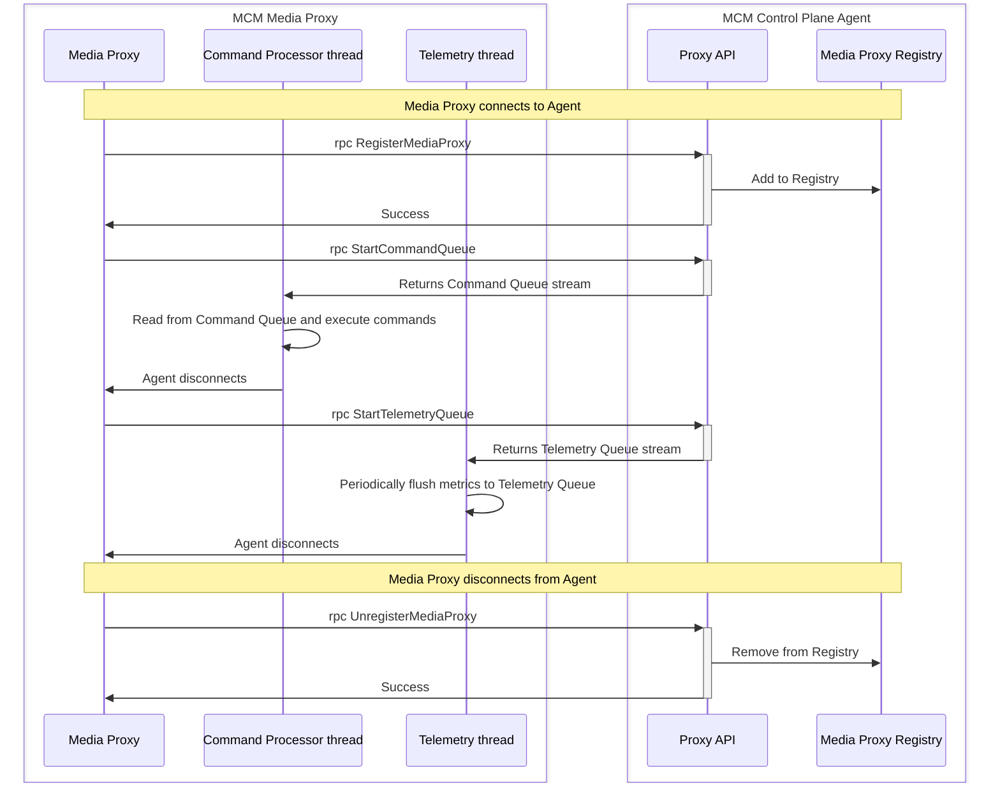
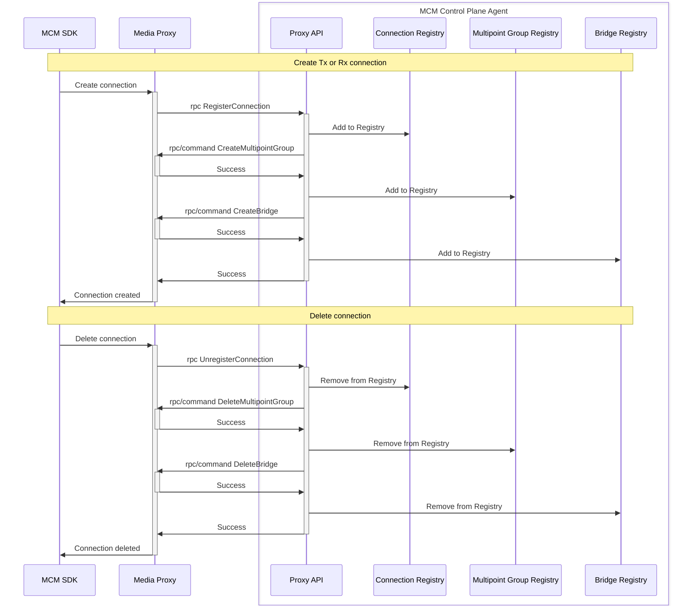

# Media Proxy Control API (**Proxy API**)

* Mesh Agent runs a server to handle **Proxy API** requests.
* Media Proxy is a client of **Proxy API**.
* **Proxy API** is based on gRPC.
* Media Proxy starts a Command Queue to allow the Agent to send commands to Media Proxy.

## Register / Unregister Media Proxy at Agent

## Register New Connection / Unregister Connection

