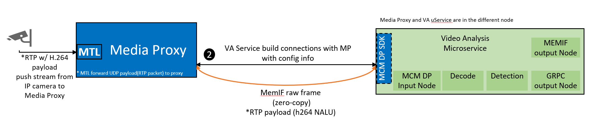

# RTP payload receive from IP Camera through MCM

The  micro-services and Media Proxy running in different node can share memory to transfer RTP payload (h264 NALU) data directly. The following is the SW stack architecture.



Media Proxy provides an efficient user-space RTP H264 NALU payload transfer to VA uService that enables users to adopt it without any changes to their code logic. The MTL stack features an LD preload layer that intercepts UDP socket API calls and replaces them with our UDP implementation. VA uService call MCM DP SDK to setup RTP H264 NALU payload transfer connection session and get the payload from the buf queue based on MemIF sharing.

Before setup the connection session, configue the IP camera with target IP address and UDP port to push the RTP H264 payload to.

When micro-services setup the connection session with Media Proxy by MCM DP SDK(defined in mcm_cp.h), The minimum required configurations are the ``mcm_conn_param.local_addr.port``, ``mcm_conn_param.type`` and ``mcm_conn_param.payload_type`` in ``mcm_dp.h``. The required configurations as requests are transfered to Media Proxy.

## 1. micro-service setup connection to Media Proxy

```bash
mcm_conn_param param = {};
param.type = is_rx;
param.payload_type = "rtsp";
param.local_addr.port = recv_port;
dp_ctx = mcm_create_connection(&param);
```

## 2. Media Proxy set up memif connection
The memif socket and connection are created by fixed connection params and the request from micro-service.

```bash
    /* Set memif socket application name and socket path.*/
    memif_socket_args.app_name = app_name;
    memif_socket_args.path = socket_path,
    /* Create memif socket.*/
    ret = memif_create_socket(memif_socket, memif_socket_args, NULL);

    /* Set memif connection args */
    memif_conn_args.socket = rx_ctx->memif_socket;
    memif_conn_args.interface_id = memif_ops->interface_id;
    memif_conn_args.buffer_size = 5184000;
    memif_conn_args.log2_ring_size = 2;
    memif_conn_args.interface_name = interface_name;
    memif_conn_args.is_master = is_master;
    /*create memif interface.*/
    ret = memif_create(memif_conn, memif_conn_args,
    rx_udp_h264_on_connect, rx_on_disconnect, rx_on_receive, rx_ctx);
```

## 3. The micro-service connects to the memif socket created in the Media Proxy

```bash
    /* Query memif info from media-proxy. */
    ret = media_proxy_query_interface(sockfd, session_id, param, &memif_param);
    /* Connect memif connection. */
    conn_ctx = mcm_create_connection_memif(param, &memif_param);
```

## 4. Media Proxy receives rtp H264 payload

Media Proxy will call mudp socket API of MTL to receive rtp H264 payload. Media Proxy removes RTP header of every RTP payload to get single NAL unit, adds H264 NALU header and calls memif tx burst API to burst the H264 NALU to memif buffer.

## 5. The micro-service gets H264 NALU from shared memif buf.

```bash
/*get data from buffer*/
buf = mcm_dequeue_buffer(dp_ctx, timeout, NULL);

/*
process the buffers.
*/

/* free buffer */
mcm_enqueue_buffer(dp_ctx, buf);
```
