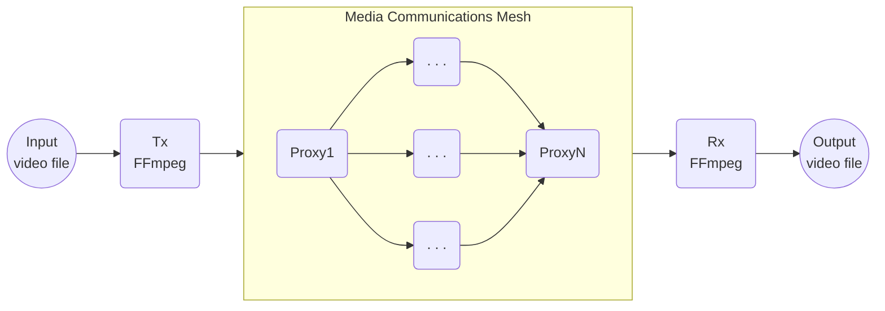
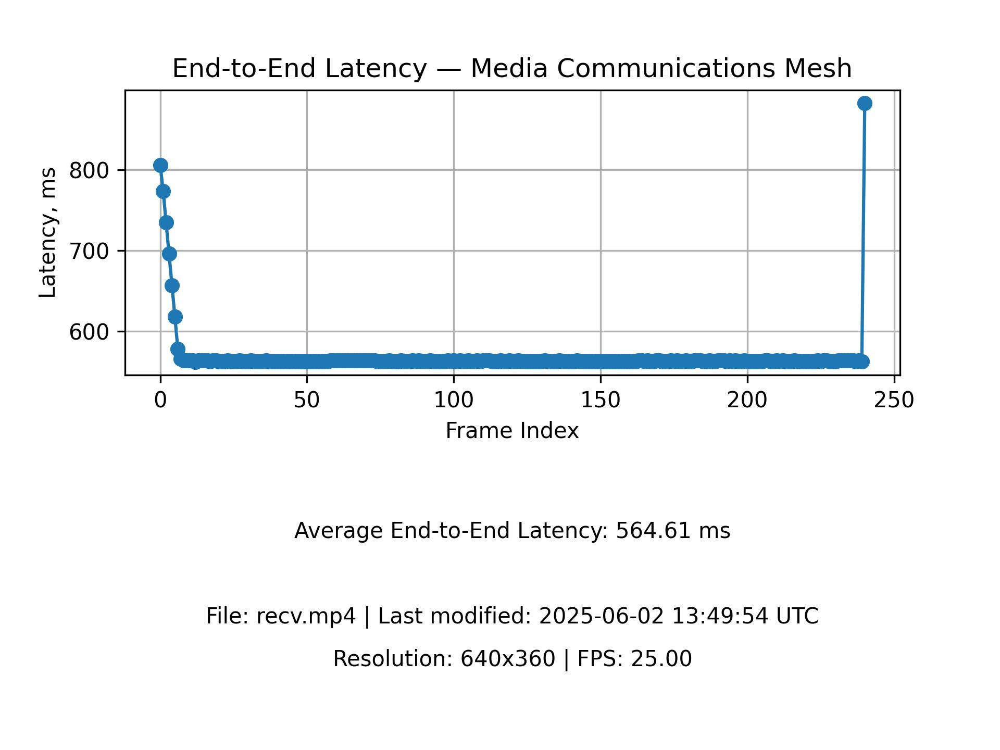

# End-to-End Latency Measurement — Media Communications Mesh

This document describes a simple solution for measuring end-to-end latency in Media Communications Mesh.

## Overview

The solution is based on the FFmpeg ability to print current timestamps on the sender side (Tx) and the receiver side (Rx), and the use of Optical Character Recognition (OCR) to read the timestamps out of each received video frame and calculate the delta. The choice of OCR is determined by the fact that the text can be effectively recognized even if the picture is affected by any sort of a lossy video compression algorithm somewhere in the transmission path in the Mesh. To achieve proper accuracy of the measurement, both Tx and Rx host machines should be synchronized using Precision Time Protocol (PTP).

> Only video payload is supported.



## How it works

1. Tx side – The user starts FFmpeg with special configuration to stream video via the Mesh.
1. Rx side – The user starts FFmpeg with special configuration to receive the video stream from the Mesh.
1. Tx side – FFmpeg prints the current timestamp as a huge text at the top of each video frame and transmits it via the Mesh.
1. Rx side – FFmpeg prints the current timestamp as a huge text at the bottom of each video frame received from the Mesh and saves it on the disk.
1. After transmission is done, there is a resulting MPEG video file on the disk on the Rx side.
1. The user runs the solution script against the MPEG file that recognizes the Tx and Rx timestamps in each frame, and calculates the average latency based on the difference between the timestamps. Additionally, the script generates a latency diagram and stores it in JPEG format on the disk.

## Sample latency diagram



## Important notice on latency measurement results

> Please note the calculated average latency is highly dependent on the hardware configuration and CPU background load, and cannot be treated as an absolute value. The provided solution can only be used for comparing the latency in different Mesh configurations and video streaming parameters, as well as latency stability checks.


## Build and install steps 

> It is assumed that Media Communications Mesh is installed on the Tx and Rx host machines according to [Setup Guide](SetupGuid.md).

If [FFmpeg Plugin](FFmpegPlugin.md) was installed earlier, remove its directory before proceeding with the following.

1. Install required packages

   ```bash
   sudo apt install libfreetype6-dev libharfbuzz-dev libfontconfig1-dev
   ```

1. Clone the FFmpeg 7.0 repository and apply patches.

   ```bash
   ./clone-and-patch-ffmpeg.sh
   ```

1. Run the FFmpeg configuration tool with special features enabled

   ```bash
   ./configure-ffmpeg.sh 7.0 --enable-libfreetype --enable-libharfbuzz --enable-libfontconfig
   ```

1. Build and install FFmpeg with the Media Communications Mesh FFmpeg plugin

   ```bash
   ./build-ffmpeg.sh
   ```

1. Install Tesseract OCR
   ```bash
   apt install tesseract-ocr
   ```
1. Install Python packages
   ```bash
   pip install opencv-python~=4.11.0 pytesseract~=0.3.13 matplotlib~=3.10.3
   ```

1. Setup time synchronization on host machines

   > Make sure `network_interface_1` and `network_interface_2` are connected to the same network.

   * __host-1 Controller clock__
      ```bash
      sudo ptp4l -i <network_interface_1> -m 2 
      sudo phc2sys -a -r -r -m
      ```

   * __host-2 Worker clock__
      ```bash
      sudo ptp4l -i <network_interface_2> -m 2 -s
      sudo phc2sys -a -r
      ```

## Example – Measuring transmission latency between two FFmpeg instances on the same host

This example demonstrates sending a video file from the 1st FFmpeg instance to the 2nd FFmpeg instance via Media Communications Mesh on the same host, and then calculation of transmission latency from the recorded video.


1. Run Mesh Agent
   ```bash
   mesh-agent
   ```

1. Run Media Proxy

   ```bash
   sudo media_proxy        \
        -d 0000:32:01.1    \
        -i 192.168.96.11   \
        -r 192.168.97.11   \
        -p 9200-9299       \
        -t 8002
   ```

1. Start the Receiver side FFmpeg instance

   ```bash
   sudo MCM_MEDIA_PROXY_PORT=8002 ffmpeg                                     \
      -f mcm                                                                 \
          -conn_type multipoint-group                                        \
          -frame_rate 60                                                     \
          -video_size 1920x1080                                              \
          -pixel_format yuv422p10le                                          \
          -i -                                                               \
      -vf                                                                    \
          "drawtext=fontsize=40:                                             \
          text='Rx timestamp %{localtime\\:%H\\\\\:%M\\\\\:%S\\\\\:%3N}':    \
          x=10: y=70: fontcolor=white: box=1: boxcolor=black: boxborderw=10" \
      -vcodec mpeg4 -qscale:v 3 recv.mp4
   ```
1. Start the Sender side FFmpeg instance

   ```bash
   sudo MCM_MEDIA_PROXY_PORT=8002 ffmpeg -i <video-file-path>             \
   -vf                                                                    \
       "drawtext=fontsize=40:                                             \
       text='Tx timestamp %{localtime\\:%H\\\\\:%M\\\\\:%S\\\\\:%3N}':    \
       x=10: y=10: fontcolor=white: box=1: boxcolor=black: boxborderw=10" \
   -f mcm                                                                 \
      -conn_type multipoint-group                                         \
      -frame_rate 60                                                      \
      -video_size 1920x1080                                               \
      -pixel_format yuv422p10le -
   ```

   When sending a raw video file, e.g. of the YUV format, you have to explicitly specify the file format `-f rawvideo`, the pixel format `-pix_fmt`, and the video resolution `-s WxH`:

   ```bash
   ffmpeg -f rawvideo -pix_fmt yuv422p10le -s 1920x1080 -i <video-file-path> ...
   ```
   
   It is also recommended to provide the read rate `-readrate` at which FFmpeg will read frames from the file:
   
   ```bash
   ffmpeg -f rawvideo -readrate 2.4 -pix_fmt yuv422p10le -s 1920x1080 -i <video-file-path> ...
   ```
   
   The `-readrate` value is calculated from the `-frame_rate` parameter value using the following equation: $readrate=framerate\div25$. Use the pre-calculated values from the table below.

   | frame_rate |      readrate     |
   |------------|-------------------|
   |    25      |   25 / 25 = 1     |
   |    50      |   50 / 25 = 2     |
   |    60      |  60 / 25 = 2.4    |

1. Run the script against the recorded MPEG file. The first argument is the input video file path. The second argument is the optional latency diagram JPEG file path to be generated.

   ```bash
   python text-detection.py recv.mp4 recv-latency.jpg
   ```

   Console output
   ```bash
   ...
   Processing Frame:  235
   Processing Frame:  236
   Processing Frame:  237
   Processing Frame:  238
   Processing Frame:  239
   Processing Frame:  240
   Saving the latency chart to:  recv-latency.jpg
   File: recv.mp4 | Last modified: 2025-06-02 13:49:54 UTC
   Resolution: 640x360 | FPS: 25.00
   Average End-to-End Latency: 564.61 ms
   ```

   See the [Sample latency diagram](#sample-latency-diagram).


## Example – Measuring transmission latency between two FFmpeg instances on different hosts

This example demonstrates sending a video file from the 1st FFmpeg instance to the 2nd FFmpeg instance via Media Communications Mesh on the same host, and then calculation of transmission latency from the recorded video.

1. Run Mesh Agent
   ```bash
   mesh-agent
   ```

1. Start Media Proxy on the Receiver host machine

   ```bash
   sudo media_proxy        \
        -d 0000:32:01.1    \
        -i 192.168.96.11   \
        -r 192.168.97.11   \
        -p 9200-9299       \
        -t 8002
   ```

1. Start the Receiver side FFmpeg instance

   ```bash
   sudo MCM_MEDIA_PROXY_PORT=8002 ffmpeg                                     \
      -f mcm                                                                 \
          -conn_type st2110                                                  \
          -transport st2110-20                                               \
          -ip_addr 192.168.96.10                                             \
          -port 9001                                                         \
          -frame_rate 60                                                     \
          -video_size 1920x1080                                              \
          -pixel_format yuv422p10le                                          \
          -i -                                                               \
      -vf                                                                    \
          "drawtext=fontsize=40:                                             \
          text='Rx timestamp %{localtime\\:%H\\\\\:%M\\\\\:%S\\\\\:%3N}':    \
          x=10: y=70: fontcolor=white: box=1: boxcolor=black: boxborderw=10" \
      -vcodec mpeg4 -qscale:v 3 recv.mp4
   ```

1. Start Media Proxy on the Sender host machine

   ```bash
   sudo media_proxy        \
        -d 0000:32:01.0    \
        -i 192.168.96.10   \
        -r 192.168.97.10   \
        -p 9100-9199       \
        -t 8001
   ```

1. Start the Sender side FFmpeg instance

   ```bash
   sudo MCM_MEDIA_PROXY_PORT=8001 ffmpeg -i <video-file-path>             \
   -vf                                                                    \
       "drawtext=fontsize=40:                                             \
       text='Tx timestamp %{localtime\\:%H\\\\\:%M\\\\\:%S\\\\\:%3N}':    \
       x=10: y=10: fontcolor=white: box=1: boxcolor=black: boxborderw=10" \
   -f mcm                                                                 \
      -conn_type st2110                                                   \
      -transport st2110-20                                                \
      -ip_addr 192.168.96.11                                              \
      -port 9001                                                          \
      -frame_rate 60                                                      \
      -video_size 1920x1080                                               \
      -pixel_format yuv422p10le -
   ```

1. Run the script against the recorded MPEG file. The first argument is the input video file path. The second argument is the optional latency diagram JPEG file path to be generated.

   ```bash
   python text-detection.py recv.mp4 recv-latency.jpg
   ```

   Console output
   ```bash
   ...
   Processing Frame:  235
   Processing Frame:  236
   Processing Frame:  237
   Processing Frame:  238
   Processing Frame:  239
   Processing Frame:  240
   Saving the latency chart to:  recv-latency.jpg
   File: recv.mp4 | Last modified: 2025-06-02 13:49:54 UTC
   Resolution: 640x360 | FPS: 25.00
   Average End-to-End Latency: 564.61 ms
   ```

   See the [Sample latency diagram](#sample-latency-diagram).

## Customization
When modifying FFmpeg commands if you change parameters of `drawtext` filter, especialy `fontsize`, `x`, `y` or `text`, you have to adjust python script __text-detection.py__ too, please refer to function `extract_text_from_region(image, x, y, font_size, length)`


<!-- References -->
[license-img]: https://img.shields.io/badge/License-BSD_3--Clause-blue.svg
[license]: https://opensource.org/license/bsd-3-clause
