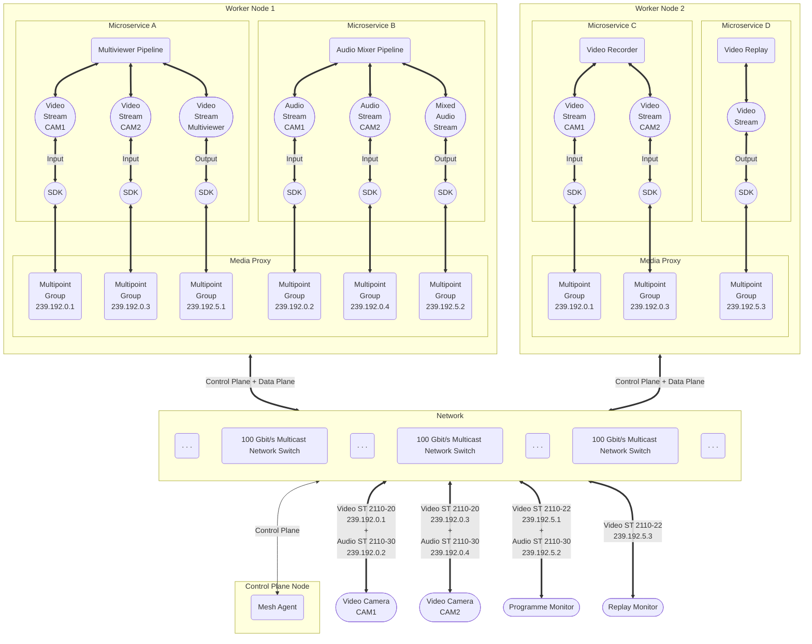

# Media Communications Mesh

[![BSD 3-Clause][license-img]][license]

> See [Online documentation](https://openvisualcloud.github.io/Media-Communications-Mesh/docs/README.html).

## Introduction

**Media Communications Mesh**, or **MCM**, is a distributed network framework designed
for real-time transmission of multimedia data, such as video, audio, or ancillary over
managed IP networks. It leverages the [Media Transport Library](https://github.com/OpenVisualCloud/Media-Transport-Library)
that implements SMPTE ST 2110 standards transmission protocols to ensure professional-grade
media streaming, commonly used in broadcast and production environments. MCM integrates
data and control planes to efficiently manage media traffic and network topology,
providing developers with an SDK for creating connections to send and receive
media streams. It supports advanced features like multipoint groups for scalable
distribution and bridges for compatibility with external networks, aiming to enhance
performance and reduce latency in media communications.

## Mesh topology example
Consider the following environment as a simple example of a live video broadcast scenario, e.g. a sports event live stream

The above diagram shows the topology established in the Mesh cluster according to the configuration requested by microservices that use SDK API.

In that diagram there are

* 2x video cameras supporting SMPTE ST 2110
   * CAM 1
   * CAM 2
* 2x video monitors supporting SMPTE ST 2110
   * Programme monitor
   * Replay monitor
* Media Communications Mesh cluster
   * Control plane node
      * Mesh Agent
   * Worker Node 1
      * Microservice A – Multiviewer pipeline
      * Microservice B – Audio mixer pipeline
   * Worker Node 2
      * Microservice C – Video recorder
      * Microservice D – Video replay
* Network multicast switch based infrastructure

## Terminology

* **Media Stream** – Continuous flow of multimedia data, such as video, audio, or ancillary, that is transmitted over the network.
* **SMPTE ST 2110** – Suite of standards developed by the Society of Motion Picture and Television Engineers ([SMPTE](https://www.smpte.org/))
for professional media streaming over managed IP networks. It is designed to facilitate the transport of video, audio, and ancillary data in real-time formats,
which is widely used in broadcast and production environments. See the [SMPTE ST 2110](https://www.smpte.org/standards/st2110) documentation.
* **Mesh** – Media Communications Mesh, a distributed multi-node network framework for transmitting media streams in real-time.
* **Data Plane** – Layer of functions responsible for the transmission of media data through the Mesh.
* **Control Plane** – Layer of functions responsible for managing and configuring the Mesh topology, components, and media traffic.
* **Client** – SDK API structure handling resource allocation flow in the Mesh. Once initialized, the client allows creating connections to the Mesh.
* **Connection** – SDK API structure handling data plane communication with the Mesh. An established connection allows sending or receiving media stream traffic in buffers.
   * **Tx connection** – Sender mode connection to the Mesh.
   * **Rx connection** – Receiver mode connection to the Mesh.
* **Buffer** – SDK API structure for handling a single piece of data transfered in a media stream. Buffers carry payload and metadata.
   * **Payload** – Single piece of media stream data, e.g. a video frame, an audio packet, or blob data.
   * **Metadata** – Arbitrary user metadata that can be carried in every buffer in an active connection.
* **Multicast Group** – Network switch configuration for a set of nodes or devices that are interested in receiving a specific stream of multicast data.
* **Multipoint Group** – Scalable distributed mechanism for sending media traffic within the Mesh to multiple receivers running on multiple nodes leveraging zero-copying to reduce latency. A multipoint group can have one sender and multiple receivers.
   * One sender – a Tx connection or an ingress bridge.
   * Multiple receivers – Rx connections or egress bridges.
* **Bridge** – Mesh software entity that handles import or export of media traffic between the Mesh and the external network.
   * **Ingress Bridge** – Bridge that receives media stream data from an SMPTE ST 2110 or RDMA connection and sends it to a multipoint group.
   * **Egress Bridge** – Bridge that receives media stream data from a multipoint group and sends it to an SMPTE ST 2110 or RDMA connection.
* **NIC** – Network interface card, e.g. Intel Ethernet Controller E810-C.
* **DPDK** – Data Plane Development Kit, a set of libraries and drivers designed to accelerate packet processing workloads running on general-purpose CPUs.
See the [DPDK](https://www.dpdk.org/) documentation.
* **MTL** – Media Transport Library, a DPDK-based library providing support for SMPTE ST 2110 media transport protocols.
See the [MTL](https://github.com/OpenVisualCloud/Media-Transport-Library/) documentation.

## Features Ready to Use

### Latest release: [25.03](https://github.com/OpenVisualCloud/Media-Communications-Mesh/releases/tag/25.03)

* SDK API modes of operation
   * Receiver mode – Rx connection to Mesh.
   * Sender mode – Tx connection to Mesh.
* Rx/Tx connection types
   * SMPTE ST 2110
      * SMPTE ST 2110-20 Uncompressed video
      * SMPTE ST 2110-22 Compressed video (JPEG XS)
      * SMPTE ST 2110-30 Audio
   * Multipoint Group
      * Supports attaching user metadata to every buffer in Mesh.
* Payload types
   * Video
      * Resolution up to FullHD 1920 x 1080
      * Frame rate up to 60 FPS
   * Audio
      * Channels
         * 1, 2, 4, etc.
      * Formats
         * PCM 16-bit
         * PCM 24-bit
      * Sample rates
         * 48000 Hz
         * 96000 Hz
   * Blob
      * Supported in SDK only.
      * Not supported in the FFmpeg plugin.

## Features Work-in-Progress

* Payload types
   * Video
      * Resolution up to 4K 4096 x 2160.
   * Audio
      * Sample rates
         * 44100 Hz

## Core software components
* **SDK** – Software Development Kit in the form of a library providing SDK API to access Mesh Communications Mesh.
   * Library file name: `libmcm_dp.so`
   * Header file to include: [`mesh_dp.h`](../sdk/include/mesh_dp.h)
   * [SDK overview](SDK.md)
   * [SDK API description](SDK_API_Definition.md)
   * [Code examples](SDK_API_Examples.md)
* **Media Proxy** – Core data plane transmission handling component running on every node in the Mesh. SDK API establishes connections with Media Proxy to send and receive media streams.
   * Supported streaming options
      * SMPTE ST 2110-20 Uncompressed Video
      * SMPTE ST 2110-22 Compressed Video (JPEG XS)
      * SMPTE ST 2110-30 Audio
      * RDMA for inter-node communication
   * Executable file name: `media_proxy`
   * For command line arguments, see the [Media Proxy](MediaProxy.md) documentation.
* **Mesh Agent** – Control plane component responsible for establishing appropriate traffic topology in the Mesh according to user app requests. It handles the life cycle of connections and multipoint groups, configures egress and ingress bridges of SMPTE ST 2110 and RDMA types, and collects Media Proxy metrics.
   * Executable file name: `mesh-agent`
   * For command line arguments, see the [MeshAgent](MeshAgent.md) documentation.

## Integration with popular media streaming software
* **FFmpeg MCM Plugin** – Device plugin for [FFmpeg](https://ffmpeg.org) utilizing SDK API to create connections to the Mesh and send or receive media streams.
   * Supports video and audio streams.
   * Allows multiple Mesh connections running in the same FFmpeg instance.
   * For command line arguments, see the [FFmpeg MCM Plugin](FFmpegPlugin.md) documentation.

## Setup and Run

Follow the [Setup Guide](SetupGuide.md) to navigate through the setup, build, and install process.

For guidance on running Media Communication Mesh, see [Runbook](Runbook.md).

## Performance
See [Performance Notes](PerformanceNotes.md) to learn how to tune the connection configuration for the best performance.

## Known issues and limitations

* There is a bug with the default docker.io package installation (version 20.10.25-0ubuntu1~22.04.2) with Ubuntu 22.04.3 LTS. The [`USER` command](https://github.com/moby/moby/issues/46355) and [`chown` command](https://github.com/moby/moby/issues/46161) do not work as expected. It is preferred to install the `docker-ce` package, following an [instruction from Docker Docs](https://docs.docker.com/engine/install/ubuntu/).

* The Authentication function of the Media Proxy interfaces is under development.

## Support

If you encounter any issues or need assistance, there are several ways to seek support

* **Update NIC firmware and drivers** – Check for your NIC firmware and/or drivers update: [Intel® Ethernet Linux Driver Repositories](https://intel.github.io/ethernet-linux/).
* **Project documents** – Search for solutions in the [Project documents](https://github.com/OpenVisualCloud/Media-Communications-Mesh/tree/main/docs).
* **Discussions** – Ask questions and seek help in the [Discussions](https://github.com/OpenVisualCloud/Media-Communications-Mesh/discussions/categories/q-a) section on the project's GitHub page.
* **Report an issue** – Report bugs and specific issues by submitting them on the [Issues](https://github.com/OpenVisualCloud/Media-Communications-Mesh/issues) page of the project's GitHub repository.
   Before submitting an issue, please check the existing documentation and discussions to avoid duplication and streamline the support process.

We are here to help, so do not hesitate to reach out to us if you need assistance.

<!-- References -->
[license-img]: https://img.shields.io/badge/License-BSD_3--Clause-blue.svg
[license]: https://opensource.org/license/bsd-3-clause
