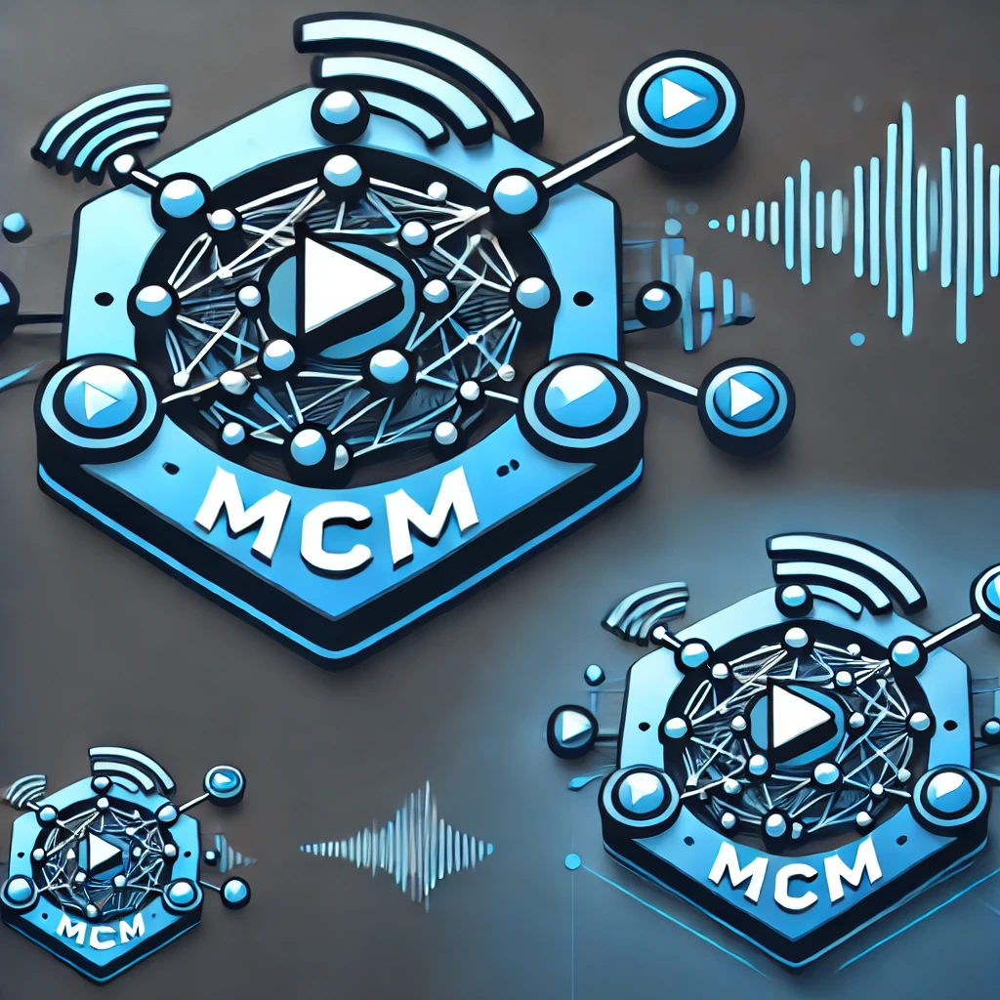

# Media Communications Mesh

> [!TIP]
> [Full Documentation](https://openvisualcloud.github.io/Media-Communications-Mesh/docs/README.html) for [Media Communications Mesh](https://openvisualcloud.github.io/Media-Communications-Mesh/docs/README.html).

[](https://github.com/OpenVisualCloud/Media-Communications-Mesh/actions/workflows/ubuntu-build.yml)
[](https://scan.coverity.com/projects/media-communications-mesh)
[](https://securityscorecards.dev/viewer/?uri=github.com/OpenVisualCloud/Media-Communications-Mesh)
[![BSD 3-Clause][license-img]][license]



## 1. Introduction

The Media Communications Mesh enables efficient, low-latency media transport for media microservices for Edge, Edge-to-Cloud, and both private and public Cloud environments. The framework creates a secure, standards-based media data plane for inter-microservices communications using a new media proxy leveraging the [Media Transport Library (MTL)](https://github.com/OpenVisualCloud/Media-Transport-Library) and adds the necessary microservices control-plane communications infrastructure to implement any media control protocol.


### 1.1. Media Communications Mesh

- **Framework Introduction**: Media Communications Mesh is a framework designed for low-latency media transport. It caters specifically to Edge, Edge-to-Cloud, and Cloud environments, connecting media microservices.
- **Purpose**: Its main role is to establish a secure media data plane for inter-microservices communication. This ensures media can be reliably transmitted across different cloud environments.
- **Technological Basis**: The Media Transport Library (MTL) helps form the media data plane, and a control-plane communications infrastructure adds support for media control protocols.

✅ **Key point**: The main goal is to enable secure, fast, and standardized media communication between microservices, regardless of the environment (Edge or Cloud).

### 1.2. Media Proxy Introduction

- **Core Functionality**: The Media Proxy handles the routing and forwarding of media data, specifically audio and video streams, between mesh nodes.
- **Low Latency & Efficiency**: The focus is on ensuring low-latency and efficient usage of system resources, which is critical for real-time media applications.
- **Service Mesh Role**: It acts as a Data Plane component within a larger service mesh for media applications, utilizing `MTL` `ST 2110` API, `libfabric` for `RDMA` API, `MemIF` shared memory APIs, and many more, to abstract the complexities involved in efficient media transport.

✅ **Key point**: Media Proxy handles the data transport layer of media streams, focusing on real-time efficiency and ensuring media routing between microservices in the mesh.

✅ More information about the Media Proxy component can be found in the [media-proxy](../media-proxy/README.md) subdirectory.

### 1.3. SDK and FFmpeg Plugins

- **Key Features**: Zero Memory Copy, uses a zero-copy memory technique for ultra-low-latency media transfers between containers. This helps avoid data duplication, reducing time and resource overhead.
- **Media Stream Compatibility**: Supports compressed (like JPEG XS) and RAW uncompressed media formats, ensuring flexibility in how media is transported.
- **Multiple Protocols**: Works with protocols such as SMPTE ST 2110 and RTSP, enhancing its versatility in different media service setups.

✅ **Key point**: The system is optimized for zero-copy transmission with wide protocol compatibility, ensuring it can handle both compressed and uncompressed media streams efficiently.

✅ Detailed information about Media Communications Mesh SDK can be found in the [sdk](../sdk/README.md) directory.

✅ Detailed information about FFmpeg with Media Communications Mesh plugin can be found in the [FFmpeg-plugin](../ffmpeg-plugin/README.md) directory.

## 2. Getting Started

### 2.1. Basic Build and Installation

#### 2.1.1. Prerequisites

- Linux server (Intel Xeon processor recommended, e.g., Sapphire Rapids).
- Network Interface Card (NIC) compatible with DPDK (e.g., Intel Ethernet Controller E810-C).
- (Recommended) Update NIC drivers and firmware. More info and latest drivers [Support](#support).

#### 2.1.2. Steps

1. **Clone the repository**

   ```bash
   git clone https://github.com/OpenVisualCloud/Media-Communications-Mesh.git
   ```

2. **Navigate to the Media-Communications-Mesh directory**

    ```bash
    cd Media-Communications-Mesh
    ```

3. **Install Dependencies**, choose between **OPTION A** or **OPTION B**.

    - **OPTION A:** Use environment preparation scripts. The scripts were tested under environments with `Ubuntu 20.04`, `Ubuntu 22.04`, `Ubuntu 24.04`, `CentOS Stream8`, and `CentOS Stream9`, installed alongside `5.15` kernel.
        To use this option run the following commands:

        ```bash
        sudo ./scripts/setup_ice_irdma.sh
        ```
        and then
        ```bash
        sudo ./scripts/setup_build_env.sh
        ```

        Reboot the machine after the scripts are executed.

    - **OPTION B:** The following method is universal and should work for most Linux OS distributions.

        - XDP-tools with eBpf: Follow the simple guide [XDP-tools](https://github.com/xdp-project/xdp-tools.git) for installation instructions.
        - MTL: Follow the [MTL setup guide](https://github.com/OpenVisualCloud/Media-Transport-Library/blob/main/doc/build.md) for installation instructions.
        - E810 driver: Follow the [MTL NIC setup guide](https://github.com/OpenVisualCloud/Media-Transport-Library/blob/main/doc/e810.md) for installation instructions.
        - gRPC: Refer to the [gRPC documentation](https://grpc.io/docs/languages/cpp/quickstart/) for installation instructions.
        - Install required packages:

            - Ubuntu/Debian
                ```bash
                sudo apt-get update
                sudo apt-get install libbsd-dev cmake make rdma-core libibverbs-dev librdmacm-dev dracut
                ```
            - CentOS stream
                ```bash
                sudo yum install -y libbsd-devel cmake make rdma-core libibverbs-devel librdmacm-devel dracut
                ```

        - Install the irdma driver and libfabric:

            ```bash
            ./scripts/setup_rdma_env.sh install
            ```
            > More information about libfabric installation can be found in [Building and installing libfabric from source](https://github.com/ofiwg/libfabric?tab=readme-ov-file#building-and-installing-libfabric-from-source).

        - Reboot

4. **Build the Media Proxy binary**

    To build Media Communications Mesh and make SDK available for development, run:

    ```bash
    ./build.sh
    ```

    By following these instructions, you'll be able to perform the basic build and installation of the Media Communications Mesh application.

### 2.2. Basic Usage

The program "media_proxy" and SDK library will be installed on the system after the "build.sh" script run successfully. To run "Media Proxy", execute the below command:

```bash
media_proxy
```
which should result in:
```text
INFO: TCP Server listening on 0.0.0.0:8002
INFO: gRPC Server listening on 0.0.0.0:8001
```

This will start the Media Proxy in blocking mode and confirm that build was successful. To close it, press `Ctrl+C`.

### 2.3. Dockerfiles Build

#### 2.3.1. Prerequisites

- Linux server (Intel Xeon processor recommended, e.g. Sapphire Rapids).
- Network Interface Card (NIC) compatible with DPDK (e.g. Intel Ethernet Controller E810-C).
- (Recommended) Update NIC drivers and firmware. More info and latest drivers [Support](#support).
- Docker engine (recommended with Buildx toolkit) configured and installed.

#### 2.3.2. Build the Docker Images

1. **Clone the repository**

   ```bash
   git clone https://github.com/OpenVisualCloud/Media-Communications-Mesh.git
   ```

2. **Navigate to the Media-Communications-Mesh directory**

    ```bash
    cd Media-Communications-Mesh
    ```

3. **Build the Dockerfiles**

> [!WARNING]
> Depending on your Docker installation, this step may require being run as `root`.

Run the below command from the root directory of the repository to build all of the Dockerfiles:

```bash
./build_docker.sh
```

### 2.4. Basic Usage (Docker)

After running the `build_docker.sh` the following Docker images will be available in the current Docker context if the script runs successfully:
- `mcm/sample-app:latest`
- `mcm/media-proxy:latest`
- `mcm/ffmpeg:latest`
- `mcm/ffmpeg:6.1-latest`

Now the "Media Proxy" can be run inside the container. To check it, execute the below command:

```bash
docker run --privileged -it -v /var/run/mcm:/run/mcm -v /dev/hugepages:/dev/hugepages mcm/media-proxy:latest
```
which should result in:
```text
INFO: TCP Server listening on 0.0.0.0:8002
INFO: gRPC Server listening on 0.0.0.0:8001
```

This will start the Media Proxy in blocking mode and confirm that build was successful. To close it, press `Ctrl+C`

### 2.5. Parameters Breakdown and Ports

Running the Media Proxy with:

```bash
media_proxy
```
should result in:
```text
INFO: TCP Server listening on 0.0.0.0:8002
INFO: gRPC Server listening on 0.0.0.0:8001
```

This will start the "Media Proxy" program. When the "Media Proxy" program launches successfully, it will open two ports to listen for control messages:
- gRPC port (default 8001) is for service mesh control plane connection.
- TCP port (default 8002) is for the connection with Media Communications Mesh SDK.

To get a full list of all supported parameters, use the `-h` flag alongside the `media_proxy` call:

```bash
media_proxy -h
```
which should print a similar usage information:
```text
Usage: media_proxy [OPTION]
-h, --help              Print this help and exit.
-d, --dev=dev_port      PCI device port (defaults: 0000:31:00.0).
-i, --ip=ip_address     IP address for media data transportation (defaults: 192.168.96.1).
-g, --grpc=port_number  Port number gRPC controller (defaults: 8001).
-t, --tcp=port_number   Port number for TCP socket controller (defaults: 8002).
```

## 3. Known Issues

- There is one bug with the default docker.io package installation (version 20.10.25-0ubuntu1~22.04.2) with Ubuntu 22.04.3 LTS. The [`USER` command](https://github.com/moby/moby/issues/46355) and [`chown` command](https://github.com/moby/moby/issues/46161) don't work as expected. It's preferred to install the docker-ce package following [instructions from Docker community](https://docs.docker.com/engine/install/ubuntu/).

- The Authentication function of the Media Proxy interfaces is currently missing. This feature is still under development, and the current implementation is weak in defending against network attacks.

## 4. Support

If you encounter any issues or need assistance, there are several ways to seek support:

- **Update NIC Firmware and Drivers:** Check for your NIC firmware and/or drivers update: [Intel® Ethernet Linux Driver Repositories](https://intel.github.io/ethernet-linux/).

- **Project Documents:** Search for solutions in the [project documents](https://github.com/OpenVisualCloud/Media-Communications-Mesh/tree/main/docs).
- **Discussions:** Ask questions and seek help in the [Discussions](https://github.com/OpenVisualCloud/Media-Communications-Mesh/discussions/categories/q-a) section on the project's GitHub page.
- **Issue Submission:** Report bugs and specific issues by submitting them on the [Issues](https://github.com/OpenVisualCloud/Media-Communications-Mesh/issues) page of the project's GitHub repository.

Before submitting an issue, please check the existing documentation and discussions to avoid duplication and streamline the support process.

We are here to help, so don't hesitate to reach out if you need assistance.

## 5. Note

This project is under development.
All source code and features on the main branch are for the purpose of testing or evaluation and not production ready.

<!-- References -->
[license-img]: https://img.shields.io/badge/License-BSD_3--Clause-blue.svg
[license]: https://opensource.org/license/bsd-3-clause
