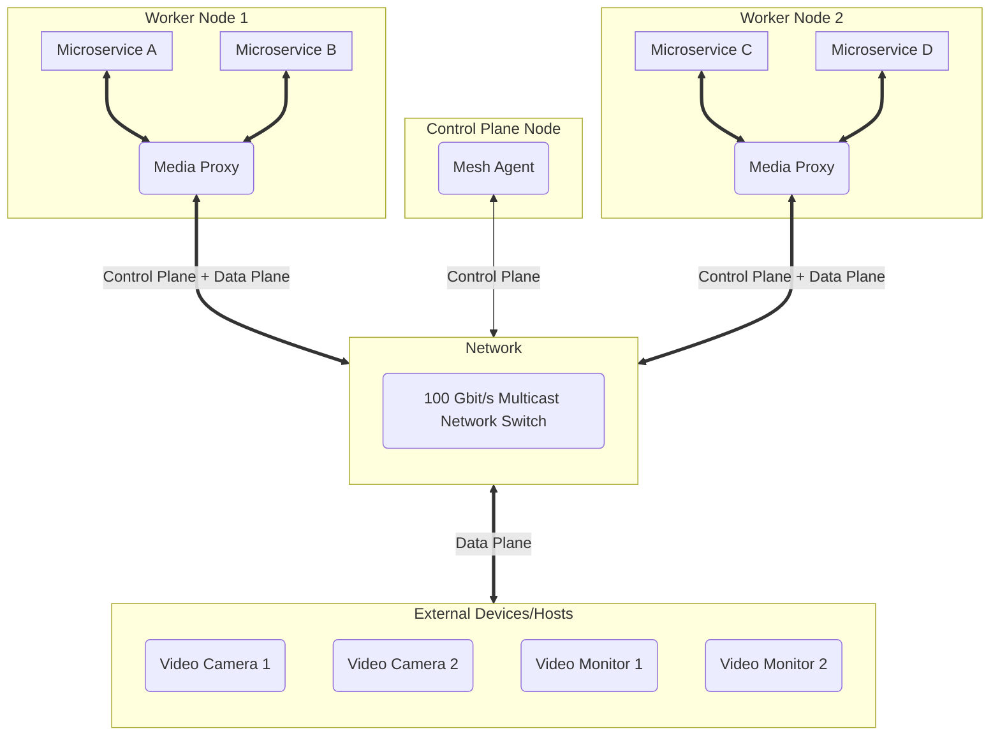

# Runbook — Media Communications Mesh

## Mesh cluster

Typical Media Communications Mesh cluster consists of the below
* **Control Node** – Single cluster control node running the following components
   * Mesh Agent – Single instance.
   * Various cluster management software.
* **Worker Nodes** – Multiple nodes equipped with high performance DPDK-supported NICs running the following software
   * Media Proxy – Single instance.
   * User apps/microservices for media streaming.
* **Multicast Network Switches** – High throughput network switches supporting multicast transmission.

The diagram shows the communication hierarchy in the Mesh cluster.



## Run Mesh Agent on a Control Node

Mesh Agent is a core control plane component responsible for establishing traffic topology in the Mesh.
The only instance of Mesh Agent is required to be running in the Mesh cluster to manage Media Proxies.

1. **Host setup**

    No specific hardware configuration is required on Control Node.
    
    The listening ports should be reachable over the network from Worker Nodes.

1. **Run Mesh Agent** (*Example*)

    ```bash
    mesh-agent -p 50051
    ```

    This starts the Mesh Agent with Proxy API listening on the port 50051 for incoming connections from Media Proxies.

    See additional command line arguments in the [Mesh Agent](MeshAgent.md) documentation.


## Run Media Proxy on a Worker Node

Media Proxy is a core data plane component handling the traffic transmission. A single instance of Media Proxy
should be running on every Worker Node in the Mesh cluster.

1. **Host setup**

   Follow the [MTL Run Guide](https://github.com/OpenVisualCloud/Media-Transport-Library/blob/main/doc/run.md) to configure the host.
   * Setup IOMMU.
   * Install or update NIC drivers and firmware.
   * Bind NIC PFs to DPDK PMD.
   * Setup hugepages.

1. **Run Media Proxy** (*Example*)

    ```bash
    sudo media_proxy              \
         -t 8002                  \
         -a 192.168.96.1:50051    \
         -d 0000:1f:01.0          \
         -i 192.168.96.10         \
         -r 192.168.97.10         \
         -p 9100-9199
    ```

    * `-t 8002` – Local port number that SDK API will be listening on for incoming SDK connections.
    * `-a 192.168.96.1:50051` – IP address and the port number of Mesh Agent.
    * `-d 0000:1f:01.0` – PCI device port for SMPTE ST 2110 media data streaming.
    * `-i 192.168.96.10` – Local IP address that will be assigned to VF at runtime by Media Proxy via DPDK.
    * `-r 192.168.97.10` – Local IP address of a host network device that will be used by Media Proxy for RDMA connections.
    * `-p 9100-9199` – Local port range for RDMA connections.

    See command line arguments in the [Media Proxy]() documentation.


## Run user apps on a Worker Node

The user applications that use SDK API to send or receive media streams via the Mesh
should be configured to connect to the Media Proxy running on the same Worker Node.

Running in privileged mode is required.

See the [SDK API description](SDK_API_Definition.md) and [Code examples](SDK_API_Examples.md)
for more information.

Refer to the [FFmpeg MCM Plugin](FFmpegPlugin.md) documentation to learn how to run it on Worker Node.

   1. **SDK API client configuration** (*Example*)
      ```json
      {
        "apiVersion": "v1",
        "apiConnectionString": "Server=127.0.0.1; Port=8002",
      }
      ```

   1. **SMPTE ST 2110 connection configuration** (*Example*)
      ```json
      {
        "connection": {
          "st2110": {
            "transport": "st2110-20",
            "remoteIpAddr": "224.0.0.1",
            "remotePort": 9002,
            "pacing": "narrow",
            "payloadType": 112,
            "transportPixelFormat": "yuv422p10rfc4175"
          },
        },
        "payload": {
          "video": {
            "width": 1920,
            "height": 1080,
            "fps": 60.0,
            "pixelFormat": "yuv422p10rfc4175"
          },
        }
      }
      ```

<!-- References -->
[license-img]: https://img.shields.io/badge/License-BSD_3--Clause-blue.svg
[license]: https://opensource.org/license/bsd-3-clause
