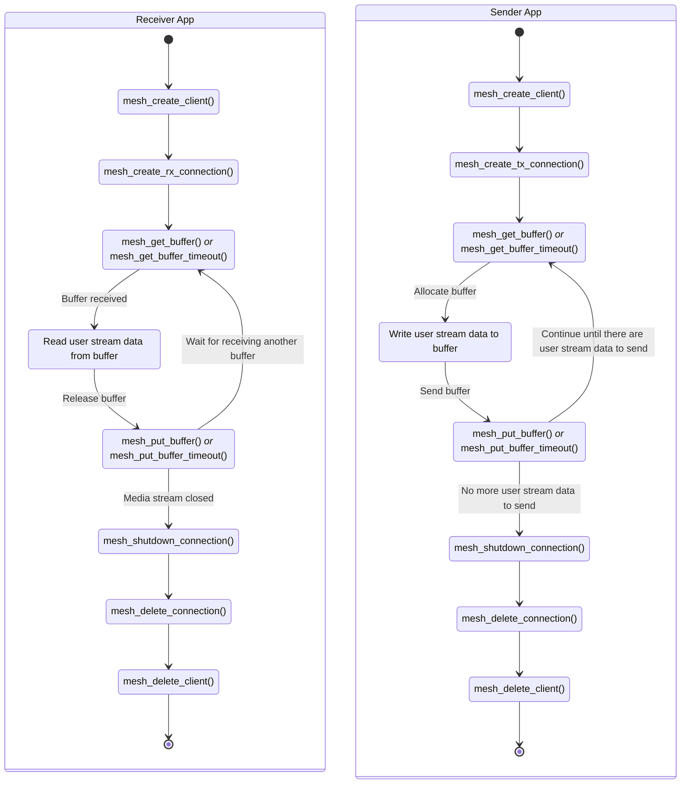

# SDK — Media Communications Mesh

SDK is the Software Development Kit in the form of a library providing SDK API to access Media Communications Mesh.
   * Library file name: `libmcm_dp.so`
   * Header file to include: [`mesh_dp.h`](../sdk/include/mesh_dp.h)

Detailed list of SDK API functions can be found in [SDK API description](SDK_API_Definition.md).

Check [Code examples](SDK_API_Examples.md) of simple user apps for sending and receiving media streams.

## General workflow
1. Create a Mesh client
   * `mesh_create_client()`
1. Create a Mesh Tx or Rx connection
   * `mesh_create_tx_connection()`
   * `mesh_create_rx_connection()`
1. Get a buffer from the Mesh connection
   * `mesh_get_buffer()`
   * `mesh_get_buffer_timeout()`
1. Set the payload length – ***Only for Tx connection***
   * `mesh_buffer_set_payload_len()`
1. Set the metadata length – ***Only for Tx connection***
   * `mesh_buffer_set_metadata_len()`
1. Put the buffer to the Mesh connection
   * `mesh_put_buffer()`
   * `mesh_put_buffer_timeout()`
1. Shutdown the Mesh connection
   * `mesh_shutdown_connection()`
1. Delete the Mesh connection
   * `mesh_delete_connection()`
1. Delete the Mesh client
   * `mesh_delete_client()`

## Usage scenarios

There are two scenarios of using the SDK
* **Receiver App** – Application that receives a media stream via the Mesh.
   * *Option A* – Receiving an **SMPTE ST 2110** compliant media stream from an external device/host on the network, e.g. from a video camera.
   * *Option B* – Receiving a media stream from **Multipoint Group** in the Mesh.
* **Sender App** – Application that sends a media stream via the Mesh.
   * *Option A* – Sending an **SMPTE ST 2110** compliant media stream to an external multicast address on the network, e.g. to a video monitor.
   * *Option B* – Sending to **Multipoint Group** to pass the media stream to multiple receivers within the Mesh.

The diagram shows the typical flow of sequential SDK API calls used in both scenarios.

<!-- References -->
[license-img]: https://img.shields.io/badge/License-BSD_3--Clause-blue.svg
[license]: https://opensource.org/license/bsd-3-clause
