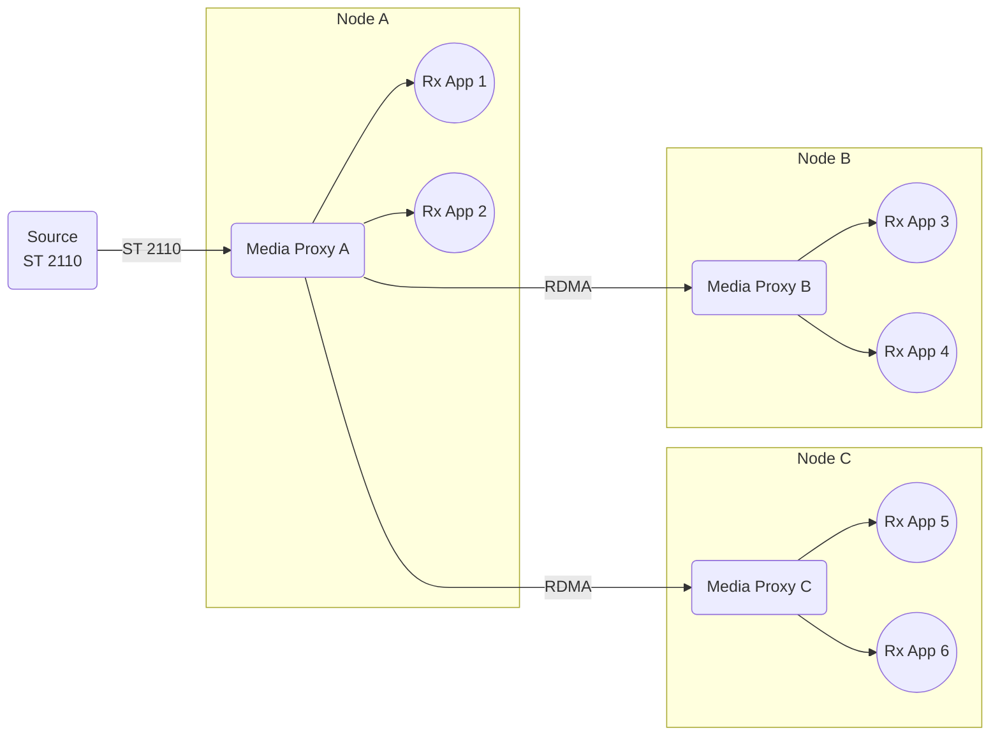
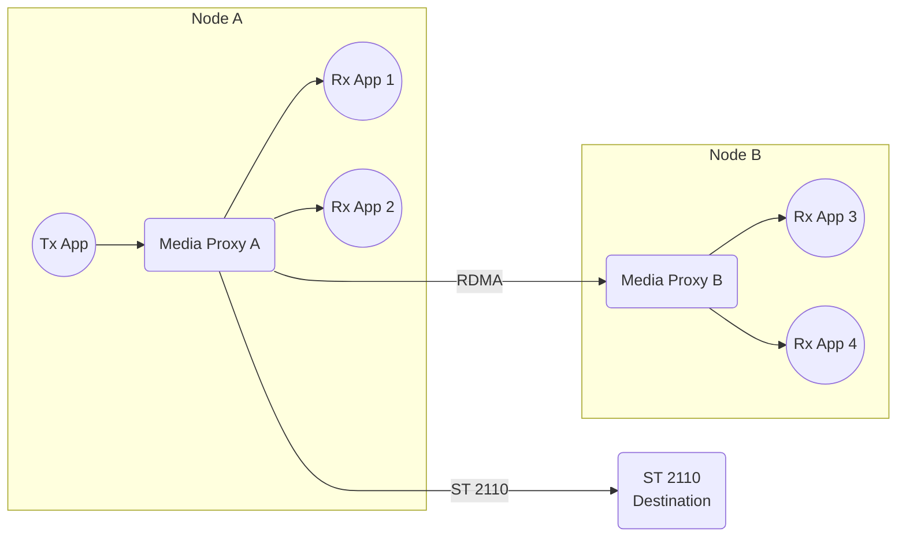
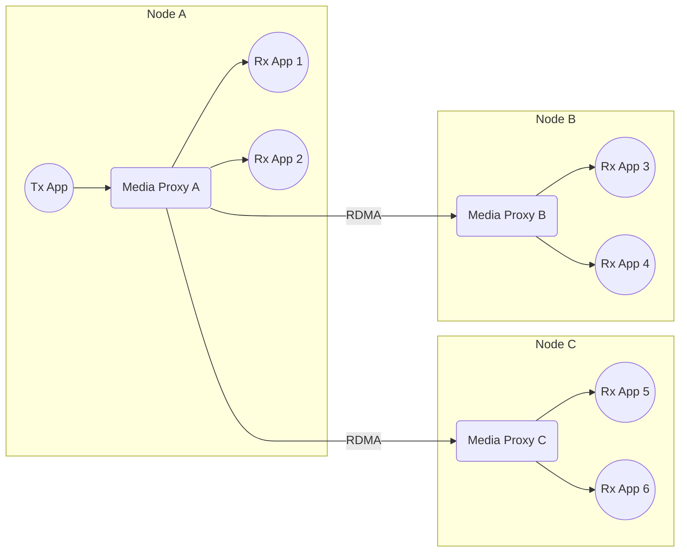

# Topology — Media Communications Mesh

The following rules are applied in Media Communications Mesh to establish the topology.

## 1. General rules

* Allow the following connection configurations
    * User app receives an SMPTE ST 2110 media stream from an external source.
    * User app sends an SMPTE ST 2110 media stream to an external destination.
    * User app sends a media stream to a multipoint group within the Mesh.
    * User app receives a media stream from a multipoint group within the Mesh.

* Apply the star interconnection topology to pass a media stream between Media Proxies within the same multipoint group via RDMA.

> Note: The following configurations are not supported
> * Send or receive an external media stream via RDMA.
> * Send an SMPTE ST 2110 media stream between user apps within the same Mesh.

## 2. Receive SMPTE ST 2110 media stream from external source

* When the user creates an ST 2110 Rx connection, an ST 2110 ingress bridge is created in Media Proxy, which the user app is connected to via SDK API.

* When the user creates another ST 2110 Rx connection in the same Media Proxy to receive the stream from the same source, the traffic received by the existing ST 2110 bridge starts passing to the user app via the multipoint group. It means that no more ST 2110 ingress bridges are created.

* When the user creates another ST 2110 Rx connection in another Media Proxy (i.e., another node) to receive the stream from the same source, an RDMA bridge connection is established between Media Proxies to pass the traffic to the user app.

## 3. Send SMPTE ST 2110 media stream to external destination

* When the user creates an ST 2110 Tx connection, an ST 2110 egress bridge is created in Media Proxy, which the user app is connected to via SDK API. Other Tx connections cannot be created to send a stream to the same destination. 

* When the user creates an ST 2110 Rx connection in the same Media Proxy to receive the stream being sent by the Tx connection, the traffic starts passing to the user app via the multipoint group. It means that an ST 2110 ingress bridge is not created.

* When the user creates another ST 2110 Rx connection in another Media Proxy (i.e., another node) to receive the stream being sent by the same Tx connection, an RDMA bridge connection is established between Media Proxies to pass the traffic to the user app.

## 4. Send media stream between user apps within the Mesh

* When the user creates a multipoint group Tx connection, no bridges are created to pass the traffic to other nodes. The Mesh is waiting for receivers to appear in the multipoint group.

* When the user creates a multipoint group Rx connection in the same Media Proxy to receive the stream being sent by the Tx connection, the traffic starts passing to the user app via the multipoint group.

* When the user creates another multipoint group Rx connection in another Media Proxy (i.e., another node) to receive the stream being sent by the same Tx connection, an RDMA bridge connection is established between Media Proxies to pass the traffic to the user app.

