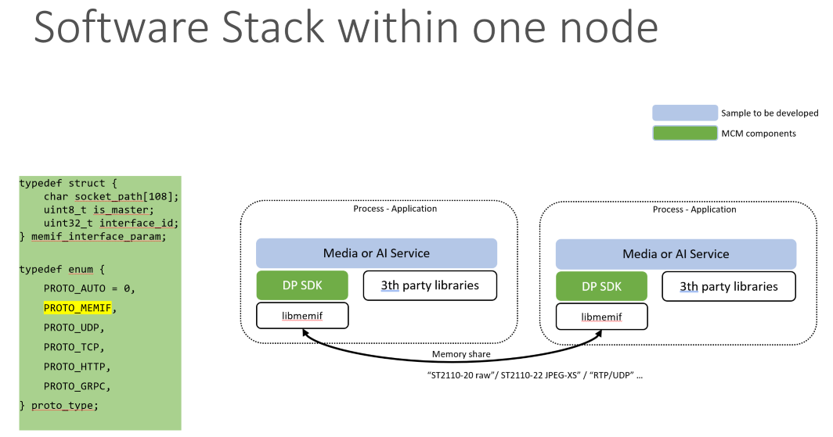

# Memif sharing

## Getting started:
The micro-services running in one node can share memory to transfer data directly. The following is the SW stack architecture and user interface API.



For detailed information on api calls and structures please refer to `mcm_dp.h`.

- The two micro-services have different roles, one should be master and the other should be slave. Set it in the `memif_interface_param.is_master`.
- The two micro-services have the same socket path. Set it as the same path in the `memif_interface_param.socket_path`.
- The interface id is used to identify peer connection. Set it as the same value in the `memif_interface_param.interface_id` for the two micro-services.
- `PROTO_MEMIF` defined in proto_type struct in `mcm_dp.h` is used for services memory sharing in one node.

## 1. Set up memif connection
First fill out the `mcm_conn_param` structure for master micro-service. The minimum required configuration is the `memif_interface`, `type`, `protocol`, `width`, `height`; > Example implementation `sdk/samples/common/recver_app.c`.

```c
mcm_conn_param param;

strncpy(param.path, socket_path, sizeof(param.path));

param.type = type;
param.memif_interface.is_master = 0;
param.memif_interface.interface_id = interface_id;
param.width = width;
param.height = height;

dp_ctx = mcm_create_connection(&param);
```

Second fill out the `mcm_conn_param` structure for slave micro-service. The minimum required configuration is the `memif_interface`, `type`, `protocol`, `width`, `height`;> Example implementation `sdk/samples/sender_app.c`.

```c
mcm_conn_param param;

strncpy(param.path, socket_path, sizeof(param.path));

param.type = type;
param.memif_interface.is_master = 1;
param.memif_interface.interface_id = interface_id;
param.width = width;
param.height = height;

dp_ctx = mcm_create_connection(&param);
```

## 2. Transmit packets

Now you are ready to transmit packets. To transmit or receive data you will need to use `mcm_buffer` and `mcm_conn_context` structure. The data pointer points directly to the shared memory packet buffer. This is where you will find/insert your packets.

First let’s receive data. To receive data call `mcm_dequeue_buffer()`. The function will fill out memif buffers passed to it. Then you would process your data (e.g. copy to your stack). Last you must refill the queue using `mcm_enqueue_buffer()` to notify peer that the buffers are now free and can be overwritten.

```c
/* Fill out memif buffers and mark them as received */
buf = mcm_dequeue_buffer(dp_ctx, timeout, NULL);
        if (buf == NULL) {
            printf("get data from buffer fail\n");
            break;
        }
/*
    Process the buffers.
*/
/* Refill the queue, so that the peer interface can transmit more packets */
if (mcm_enqueue_buffer(dp_ctx, buf) != 0) {
     printf("free buffer fail\n");
     break;
}
```

Second let’s send data. To send data call `mcm_dequeue_buffer()` and `mcm_enqueue_buffer()`. The function `mcm_dequeue_buffer()` will allocate memif buffers for micro-service. Then you would process your data (e.g. copy data to the buf). Last you must refill the queue using `mcm_enqueue_buffer()` to notify peer that the buffers are now ready and data can be used.

```c

/* Alocate memif buffers */
buf = mcm_dequeue_buffer(dp_ctx, -1, NULL);
if (buf == NULL) {
    break;
}
/*
    Fill out the buffers.

    buf.data field points to the shared memory.
    update buf.len to your packet length.
    update buf.metadata.seq_num to your packet sequence number.
    update buf.metadata.timestamp to your packet timestamp.
*/

/* Transmit the buffers */
if (mcm_enqueue_buffer(dp_ctx, buf) != 0) {
    break;
}
```
