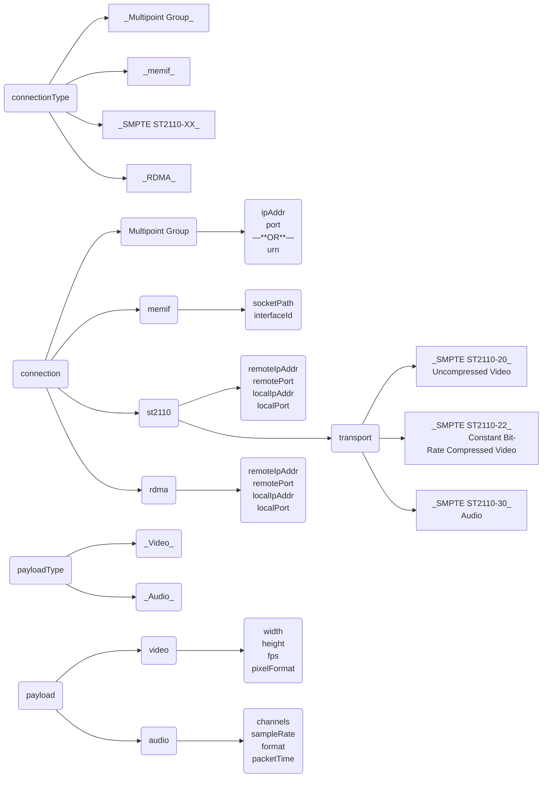

# Mesh Data Plane SDK – API Workflow
## General Workflow
1. Create a Mesh client:
   * `mesh_create_client()`
1. Create a Mesh Tx or Rx connection:
   * `mesh_create_tx_connection()`
   * `mesh_create_rx_connection()`
1. Get a buffer from the Mesh connection:
   * `mesh_get_buffer()`
   * `mesh_get_buffer_timeout()`
1. Put the buffer to the Mesh connection:
   * `mesh_put_buffer()`
   * `mesh_put_buffer_timeout()`
1. Shutdown the Mesh connection:
   * `mesh_shutdown_connection()`
1. Delete the Mesh connection:
   * `mesh_delete_connection()`
1. Delete the Mesh client:
   * `mesh_delete_client()`

## Configure Connection – Multipoint Group
1. Define a memif configuration in JSON format:
```json
"connType": "memif",
"connection": {
  "memif": {
    "socketPath": "mcm_socket_0",
    "interfaceId": 0
  }
}
```

## Configure Connection – Memif
1. Define a memif configuration in JSON format:
```json
"connType": "memif",
"connection": {
  "memif": {
    "socketPath": "mcm_socket_0",
    "interfaceId": 0
  }
}
```

## Configure Connection – SMPTE ST2110-XX
1. Define an SMPTE ST2110-XX configuration:
```json
"connType": "st2110",
"connection": {
  "st2110": {
    "transport": "st2110-22",
    "remoteIpAddr": "192.168.95.2",
    "remotePort": "9002",
    "localIpAddr": "192.168.95.1",
    "localPort": "9001"
  }
}
```

## Configure Connection – RDMA
1. Define an RDMA configuration:
```json
"connType": "rdma",
"connection": {
  "rdma": {
    "remoteIpAddr": "192.168.95.2",
    "remotePort": "9002",
    "localIpAddr": "192.168.95.1",
    "localPort": "9001"
  }
}
```

## Configure Payload – Video
1. Define a video configuration:
```json
"payloadType": "video",
"payload": {
  "video": {
    "width": 1920,
    "height": 1080,
    "fps": 60.0,
    "pixelFormat": "yuv422p10le"
  }
}
```

## Configure Payload – Audio
```json
"payloadType": "audio",
"payload": {
  "audio": {
    "channels": 2,
    "sampleRate": 48000,
    "format": "pcm_s24be",
    "packetTime": "1ms"
  }
}
```

## Configure payload – Raw data
```json
"payloadType": "raw",
"maxPayloadSize": 2097152
```

## Configure metadata
```json
"maxMetadataSize": 8192
```

## Mesh DP SDK API Internals – Connection Configuration flowchart


