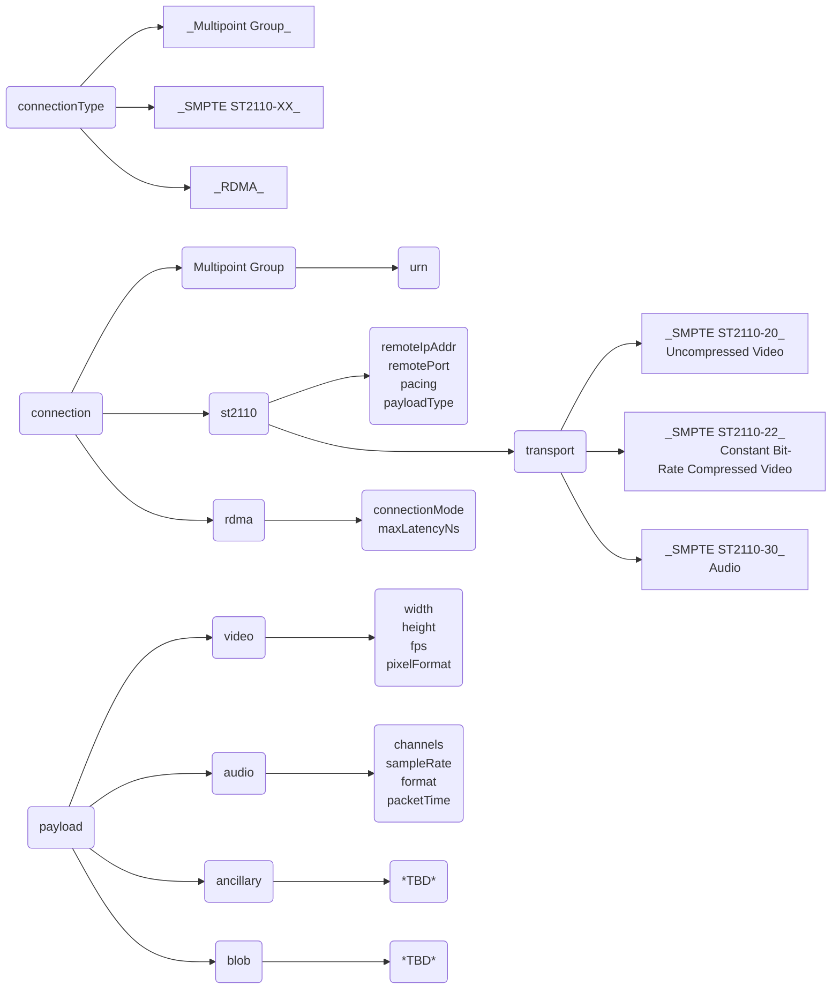

# Mesh Data Plane SDK – API Workflow
## General Workflow
1. Create a Mesh client:
   * `mesh_create_client()`
1. Create a Mesh Tx or Rx connection:
   * `mesh_create_tx_connection()`
   * `mesh_create_rx_connection()`
1. Get a buffer from the Mesh connection:
   * `mesh_get_buffer()`
   * `mesh_get_buffer_timeout()`
1. Put the buffer to the Mesh connection:
   * `mesh_put_buffer()`
   * `mesh_put_buffer_timeout()`
1. Shutdown the Mesh connection:
   * `mesh_shutdown_connection()`
1. Delete the Mesh connection:
   * `mesh_delete_connection()`
1. Delete the Mesh client:
   * `mesh_delete_client()`

## Configure Connection – Multipoint Group
```json
"connection": {
  "multipoint-group": {
    "ipAddr": "224.0.0.1",
    "port": "9003"
  }
}
```

## Configure Connection – SMPTE ST2110-XX
```json
"connection": {
  "st2110": {
    "transport": "st2110-22",
    "remoteIpAddr": "192.168.95.2",
    "remotePort": "9002",
    "pacing": "narrow",
    "payloadType": 112
  }
}
```

## Configure Connection – RDMA
```json
"connection": {
  "rdma": {
    "connectionMode": "RC",
    "maxLatencyNs": 10000
  }
}
```

## Configure Payload – Video
```json
"payload": {
  "video": {
    "width": 1920,
    "height": 1080,
    "fps": 60.0,
    "pixelFormat": "yuv422p10le"
  }
}
```
| BCS(json string) | MTL-transport_format(enum st20_fmt) | MTL {in/out}put_format(enum st_frame_fmt) | FFMPEG (enum PixelFormat) | RFC 4715 compliant | Note |
|------------------|-------------------------------------|-------------------------------------------|---------------------------|--------------------|------|
| y210le | ST20_FMT_YUV_422_10BIT | ST_FRAME_FMT_Y210 |AV_PIX_FMT_Y210LE | ?? | -- |
| yuv422p10le | ST20_FMT_YUV_422_PLANAR10LE | ST_FRAME_FMT_YUV422PLANAR10LE | PIX_FMT_YUV422P10LE | N | -- |
| yuv422p10le_rfc4715 | ST20_FMT_YUV_422_10BIT | ST_FRAME_FMT_YUV422RFC4175PG2BE10 | N/A | Y | -- |
| yuv422p10le_rfc4715_convert | ST20_FMT_YUV_422_10BIT | ST_FRAME_FMT_YUV422PLANAR10LE | PIX_FMT_YUV422P10LE | Y | ST2110 run additional Internal conversion before and after transport |

ST2110-22 and RDMA connection take into consideration only ST_FRAME_FMT_* video format 

## Configure Payload – Audio
```json
"payload": {
  "audio": {
    "channels": 2,
    "sampleRate": 48000,
    "format": "pcm_s24be",
    "packetTime": "1ms"
  }
}
```

## Configure Payload – Blob Data
```json
"payload": {
  "blob": {
   ...
  }   
},
"maxPayloadSize": 2097152
```
The `maxPayloadSize` is set above explicitly to define the buffer size for Blob.

## Configure Optional Parameters
```json
"bufferQueueCapacity": 16,
"maxMetadataSize": 8192
```

## Mesh DP SDK API Internals – Connection Configuration Flowchart


