# Test Scenarios – Single Multipoint Group

The following scenarios allow to validate the Mesh transmission in a single Multipoint Group.

To validate it with multiple Multipoint Groups, run a combination of scenarios simultaneously, e.g. **Scenario 2.5** + **Scenario 4.3** + **Scenario 6.3**.

## **Scenarios 1.x** – Local Single Node Transmission (memif)

### **Scenario 1.1** – Single Node / Single Receiver — Blob, Video, Audio

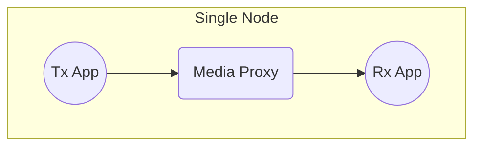

### **Scenario 1.2** – Single Node / 3x Receivers — Blob, Video, Audio

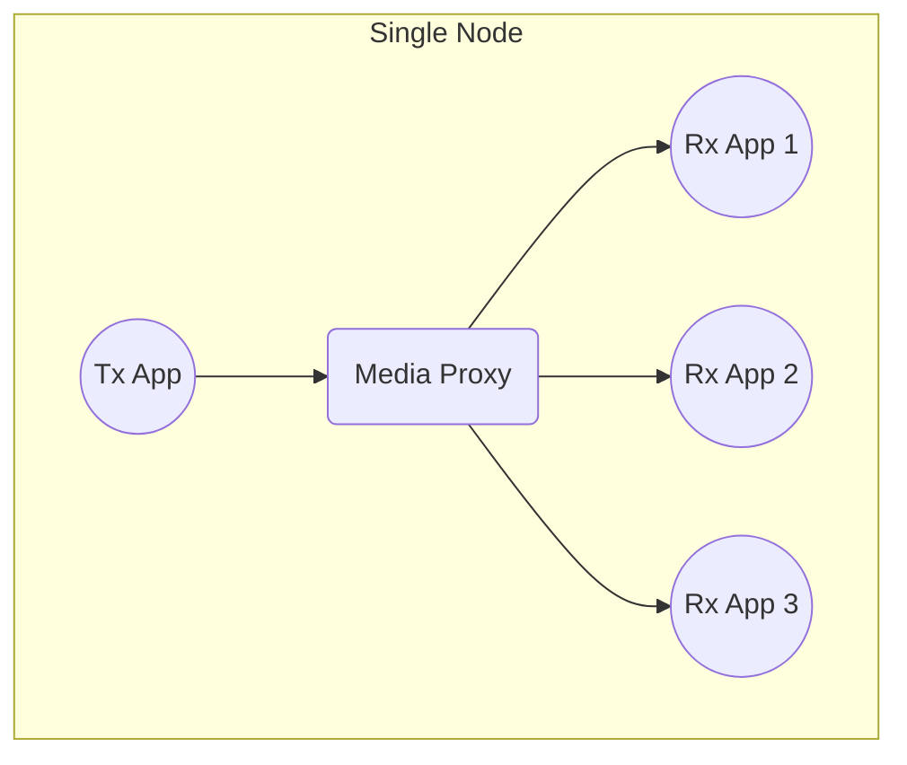

## **Scenarios 2.x** – RDMA Transmission

### **Scenario 2.1** – 2x Nodes · _Direct Network Cable Connection_ / Single Receiver — Blob, Video, Audio

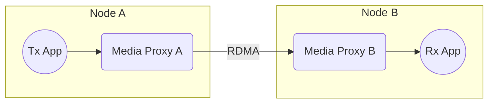

### **Scenario 2.2** – 2x Nodes / Single Receiver — Blob, Video, Audio

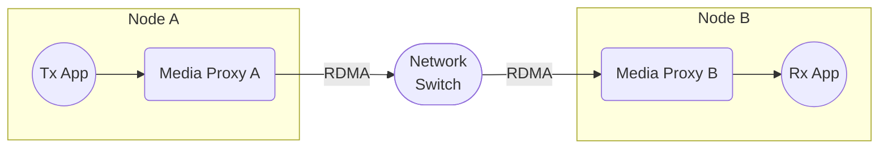

### **Scenario 2.3** – 2x Nodes / 1x Receiver per Node — Blob, Video, Audio

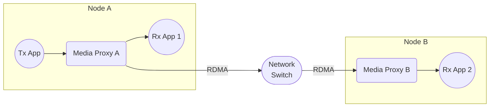

### **Scenario 2.4** – 2x Nodes / 2x Receivers per Node — Blob, Video, Audio

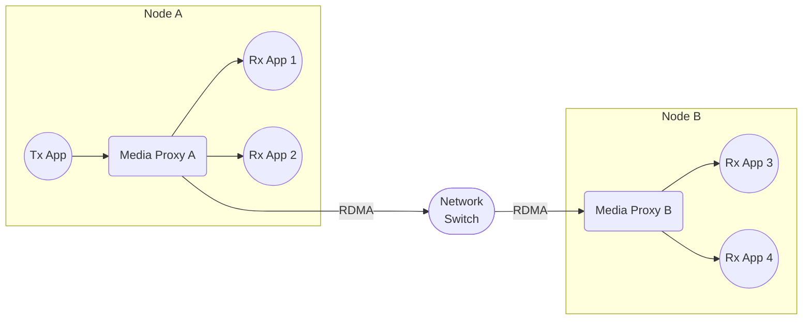

### **Scenario 2.5** – 3x Nodes / 2x Receivers per Node — Blob, Video, Audio

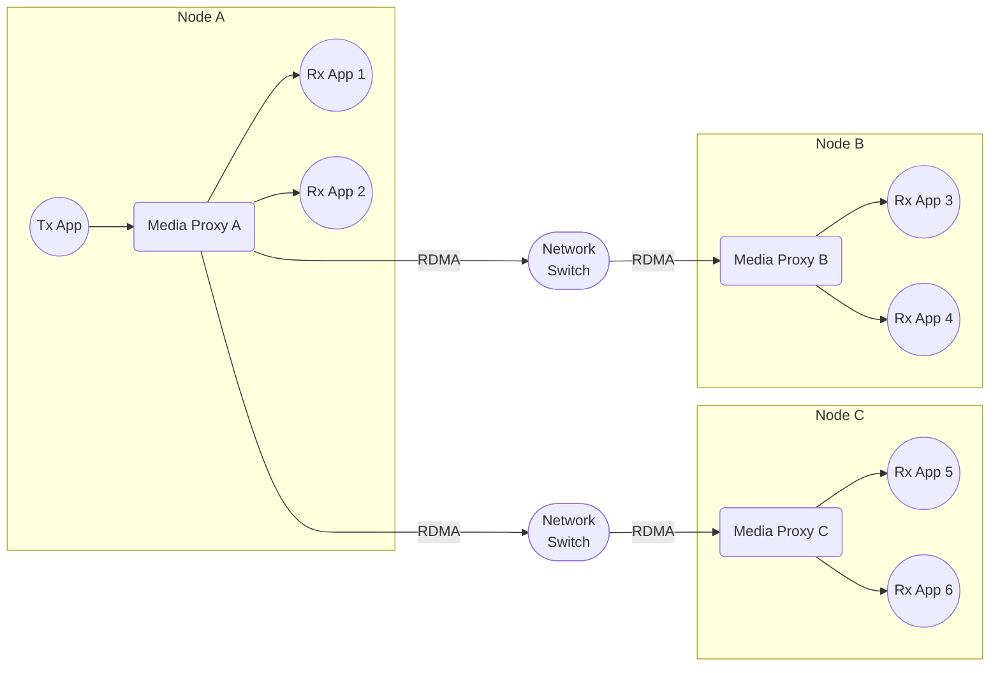

## **Scenarios 3.x** – ST 2110 Outbound Transmission – Single Node

### **Scenario 3.1** – Single Node · _Direct Network Cable Connection_ — Video, Audio

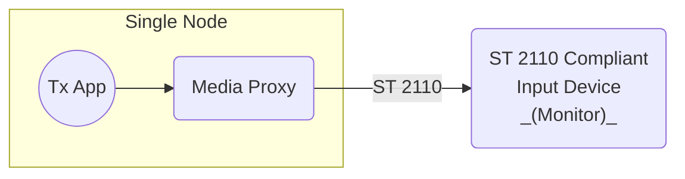

### **Scenario 3.2** – Single Node — Video, Audio

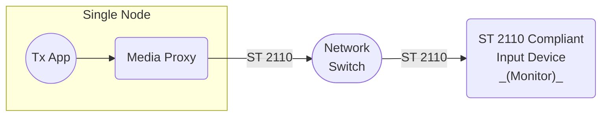

### **Scenario 3.3** – Single Node / Local Receiver — Video, Audio

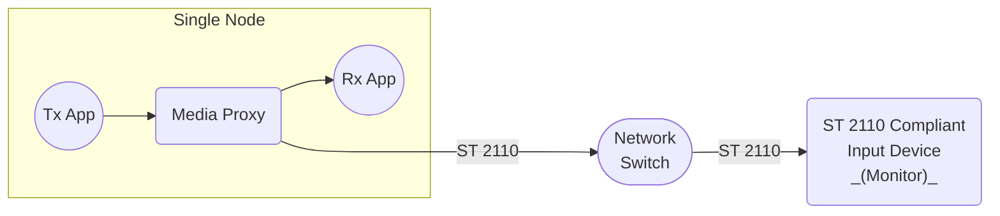

## **Scenarios 4.x** – ST 2110 Outbound Transmission – Multiple Nodes

### **Scenario 4.1** – 2x Nodes / 1x Receiver per Node — Video, Audio

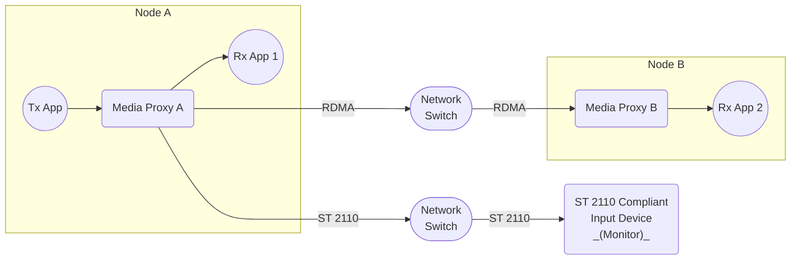

### **Scenario 4.2** – 2x Nodes / 2x Receivers per Node — Video, Audio

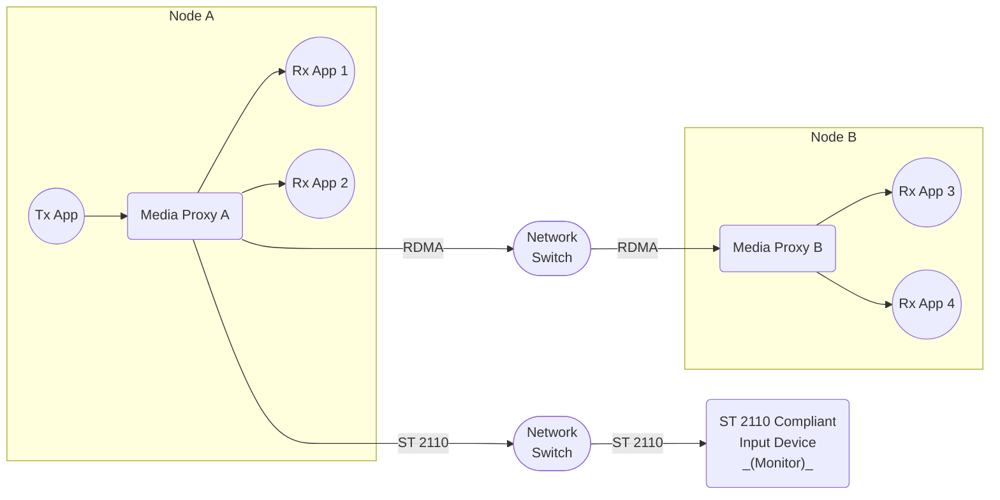

### **Scenario 4.3** – 3x Nodes / 2x Receivers per Node — Video, Audio

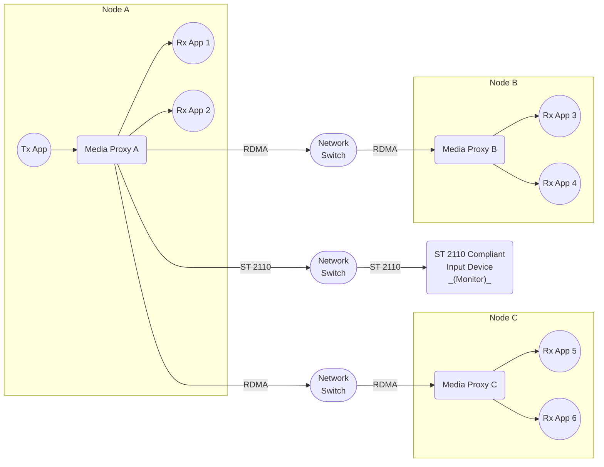

## **Scenarios 5.x** – ST 2110 Inbound Transmission – Single Node

### **Scenario 5.1** – Single Node · _Direct Network Cable Connection_ / Single Receiver — Video, Audio

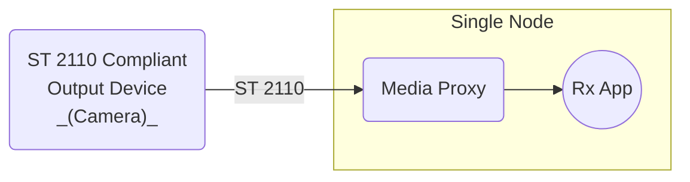

### **Scenario 5.2** – Single Node / Single Receiver — Video, Audio

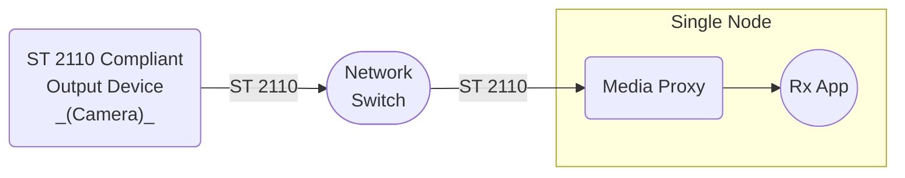

### **Scenario 5.3** – Single Node / 3x Receivers — Video, Audio

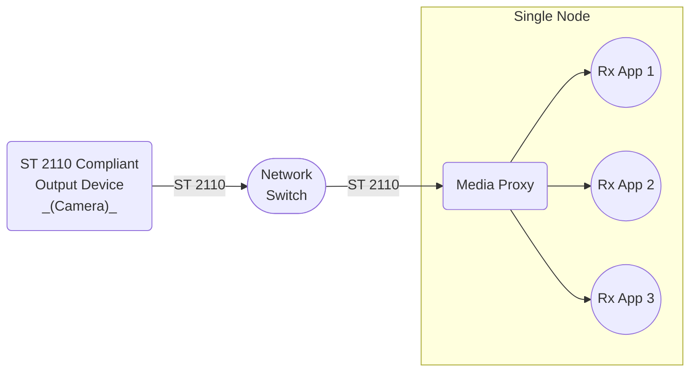

## **Scenarios 6.x** – ST 2110 Inbound Transmission – Multiple Nodes

### **Scenario 6.1** – 2x Nodes / 1x Receiver per Node — Video, Audio

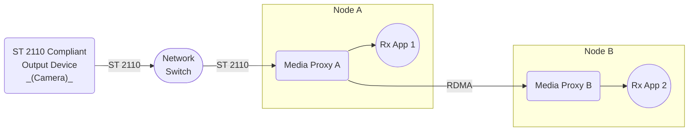

### **Scenario 6.2** – 2x Nodes / 2x Receivers per Node — Video, Audio

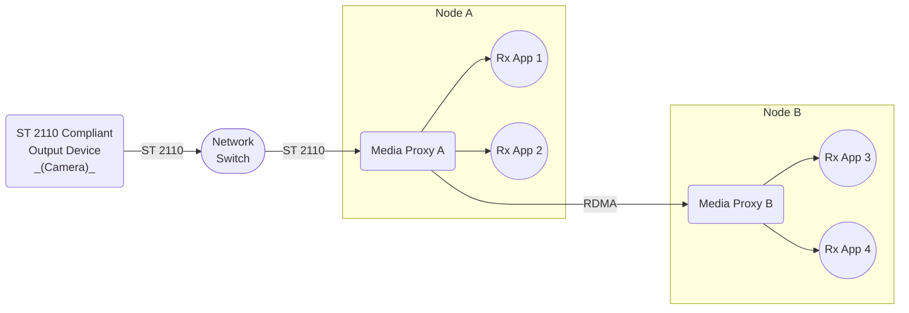

### **Scenario 6.3** – 3x Nodes / 2x Receivers per Node — Video, Audio

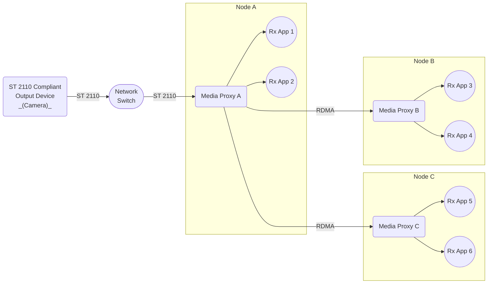
