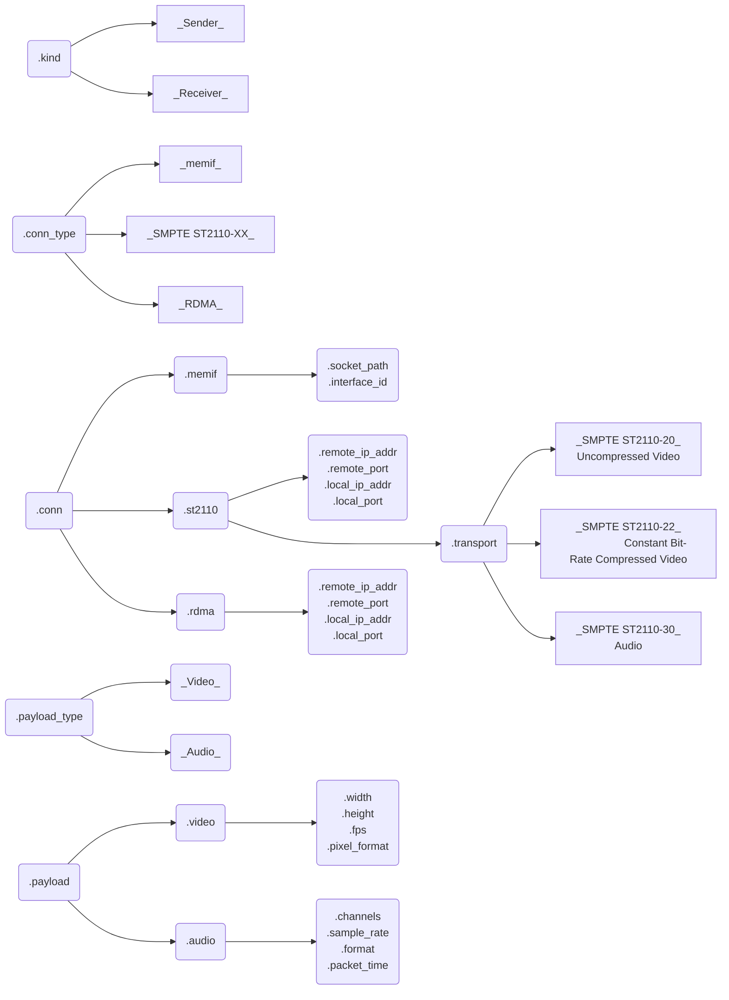
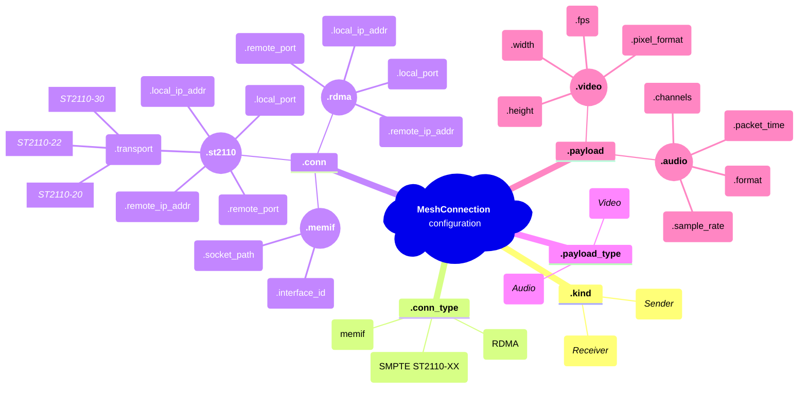

# Mesh Data Plane SDK – API Workflow

## General workflow

1. Create a Mesh client:
   - `mesh_create_client()`
2. Create a Mesh connection:
   - `mesh_create_connection()`
3. Apply the connection configuration:
   - `struct MeshConfig_Memif {...}` -> `mesh_apply_config_memif()`
   - `struct MeshConfig_ST2110 {...}` -> `mesh_apply_config_st2110()`
   - `struct MeshConfig_RDMA {...}` -> `mesh_apply_config_rdma()`
4. Apply the payload configuration:
   - `struct MeshConfig_Video` -> `mesh_apply_config_video()`
   - `struct MeshConfig_Audio` -> `mesh_apply_config_audio()`
5. Establish the Mesh connection:
   - `mesh_establish_connection()`
6. Get a buffer from the Mesh connection:
   - `mesh_get_buffer()`
   - `mesh_get_buffer_timeout()`
7. Put the buffer to the Mesh connection:
   - `mesh_put_buffer()`
   - `mesh_put_buffer_timeout()`
8. Shutdown the Mesh connection:
   - `mesh_shutdown_connection()`
9. Delete the Mesh connection:
   - `mesh_delete_connection()`
10. Delete the Mesh client:
   - `mesh_delete_client()`

## Configure connection – Memif

1. Define a memif configuration:
   - `struct MeshConfig_Memif`
     - `.socket_path`
     - `.interface_id`
2. Apply the configuration:
   - `mesh_apply_config_memif()`

## Configure connection – SMPTE ST2110-XX

1. Define an SMPTE ST2110-XX configuration:
   - `struct MeshConfig_ST2110`
     - `.remote_ip_addr`
     - `.remote_port`
     - `.local_ip_addr`
     - `.local_port`
     - `.transport`
       - `MESH_CONN_TRANSPORT_ST2110_20` – SMPTE ST2110-20 Uncompressed Video
       - `MESH_CONN_TRANSPORT_ST2110_22` – SMPTE ST2110-22 Constant Bit-Rate Compressed Video
       - `MESH_CONN_TRANSPORT_ST2110_30` – SMPTE ST2110-30 Audio
2. Apply the configuration:
   - `mesh_apply_config_st2110()`

## Configure connection – RDMA

1. Define an RDMA configuration:
   - `struct MeshConfig_RDMA`
     - `.remote_ip_addr`
     - `.remote_port`
     - `.local_ip_addr`
     - `.local_port`
2. Apply the configuration:
   - `mesh_apply_config_rdma()`

## Configure payload – Video

1. Define a video configuration:
   - `struct MeshConfig_Video`
     - `.width`
     - `.height`
     - `.fps`
     - `.pixel_format` – `MESH_VIDEO_PIXEL_FORMAT_*`
2. Apply the configuration:
   - `mesh_apply_config_video()`

## Configure payload – Audio

1. Define an audio configuration:
   - `struct MeshConfig_Audio`
     - `.channels`
     - `.sample_rate` – `MESH_AUDIO_SAMPLE_RATE_*`
     - `.format` – `MESH_AUDIO_FORMAT_*`
     - `.packet_time` – `MESH_AUDIO_PACKET_TIME_*`
2. Apply the configuration:
   - `mesh_apply_config_audio()`

## Mesh DP SDK API internals – Connection configuration flowchart

## Mesh DP SDK API internals – Connection configuration mindmap

