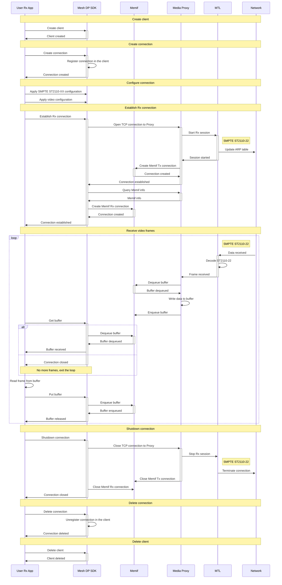

# Mesh Data Plane SDK – Example / SMPTE ST2110-22 RX Flow

The diagram in this document shows interaction between a user app and Mesh Data Plane in the video receive mode over SMPTE ST2110-22.

## RX flow stages
1. Create client.
1. Create connection.
1. Configure connection.
1. Establish Rx connection.
1. Receive video frames.
1. Shutdown connection.
1. Delete connection.
1. Delete client.

