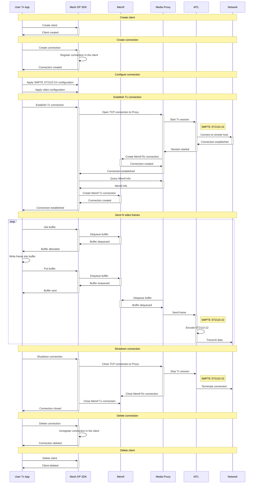

# Mesh Data Plane SDK – Example / SMPTE ST2110-22 Tx Flow

The diagram in this document shows interaction between a user app and Mesh Data Plane in the video transmit mode over SMPTE ST2110-22.

### Tx flow stages
1. Create client.
1. Create connection.
1. Configure connection.
1. Establish Tx connection.
1. Send N video frames.
1. Shutdown connection.
1. Delete connection.
1. Delete client.

