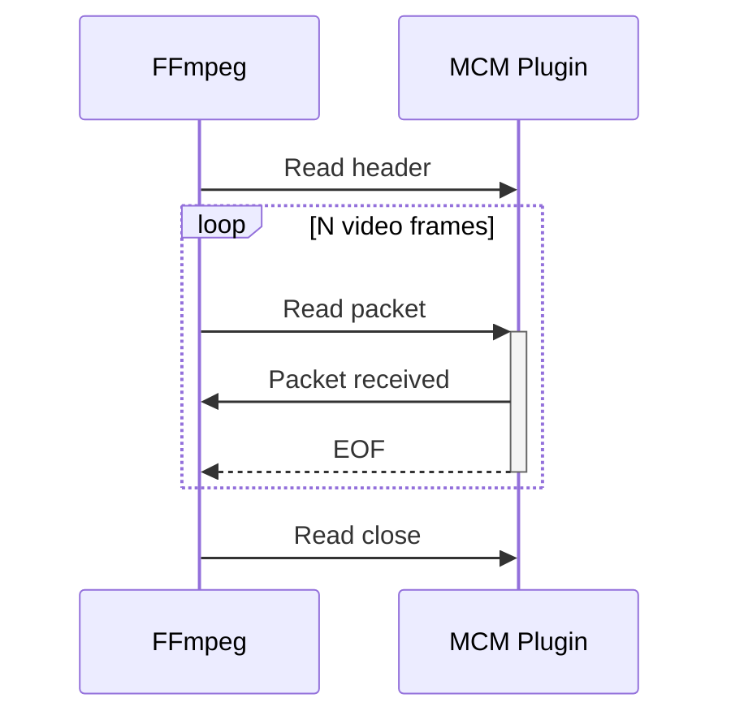
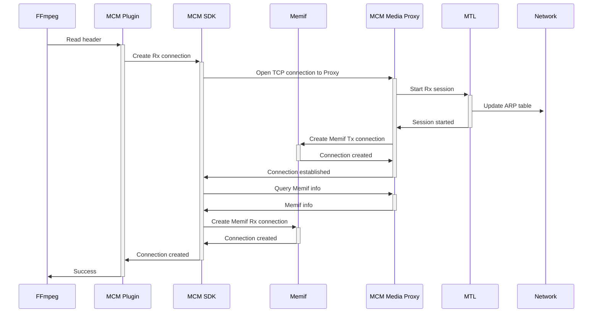
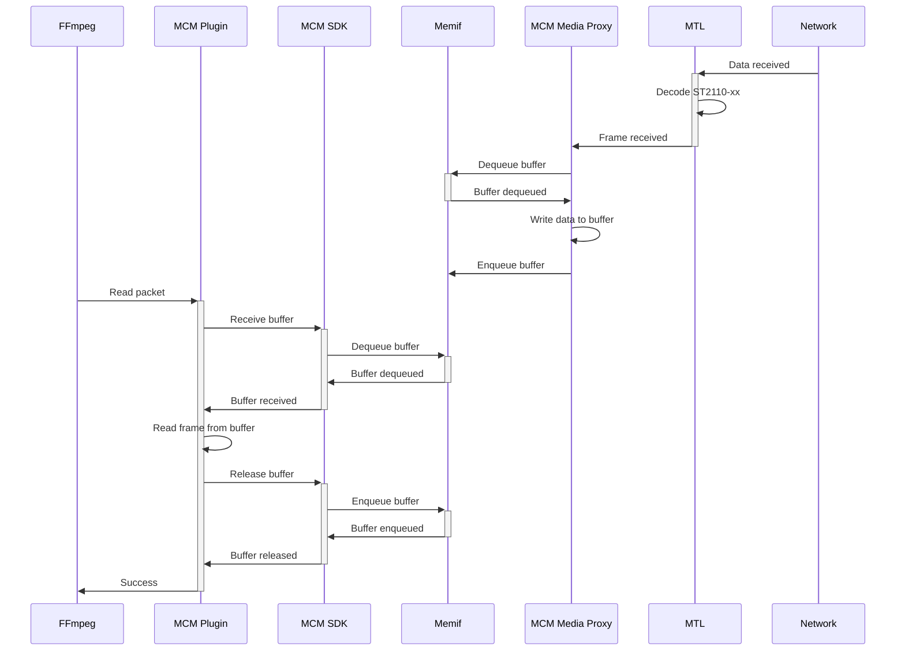
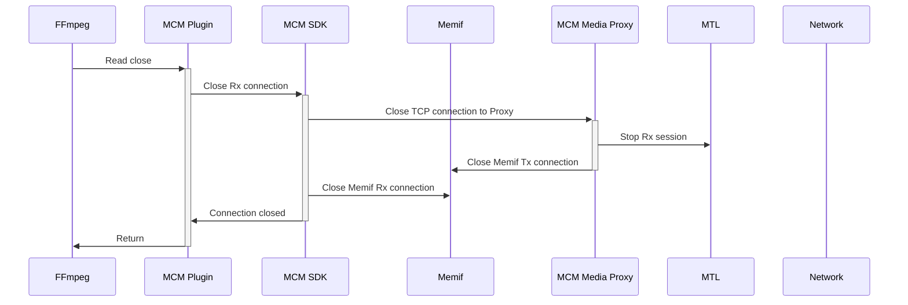

# Rx flow

Diagrams in this document show interaction between FFmpeg and the MCM plugin when FFmpeg is receiving a video stream over MCM.

### Simplified FFmpeg Rx flow

### FFmpeg Read Header flow

### FFmpeg Read Packet flow

### FFmpeg Read Close flow

