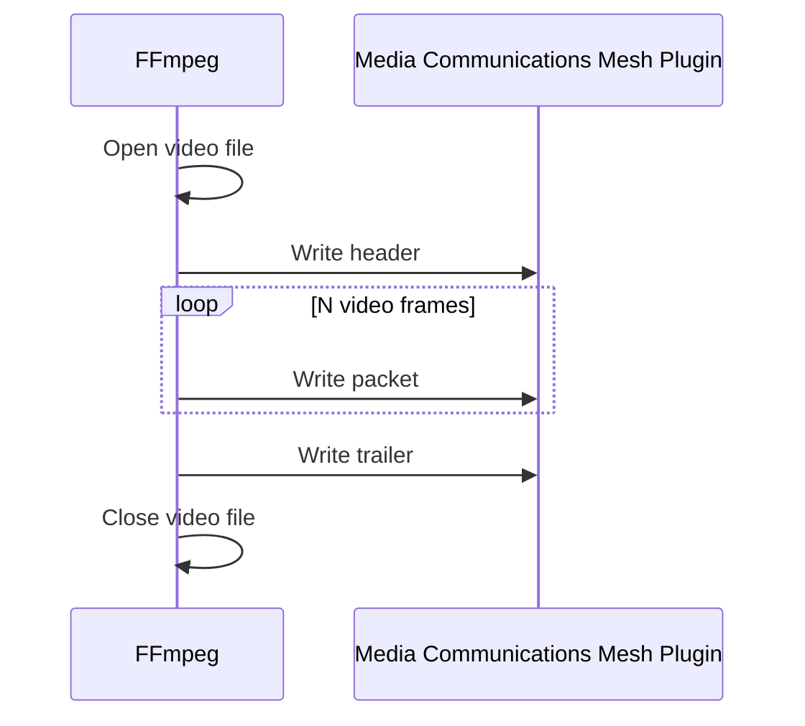
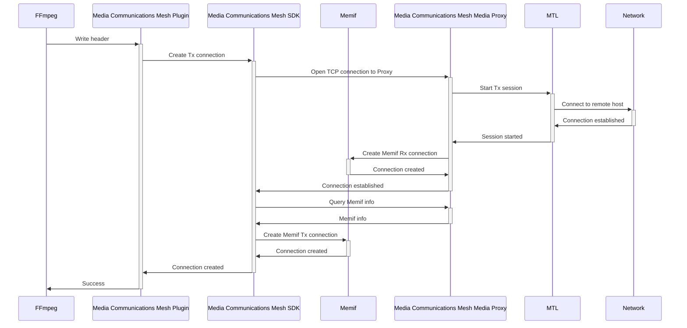
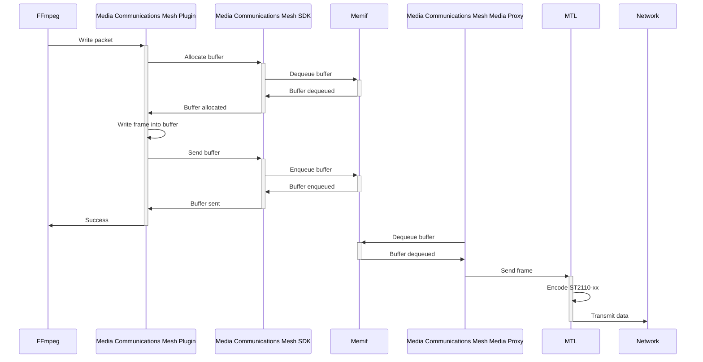
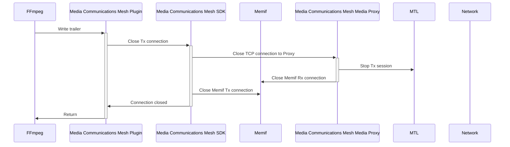

# Tx flow

Diagrams in this document show interaction between FFmpeg and the Media Communications Mesh plugin when FFmpeg is streaming a video file over Media Communications Mesh.

## Simplified FFmpeg Tx flow

## FFmpeg Write Header flow

## FFmpeg Write Packet flow

## FFmpeg Write Trailer flow

