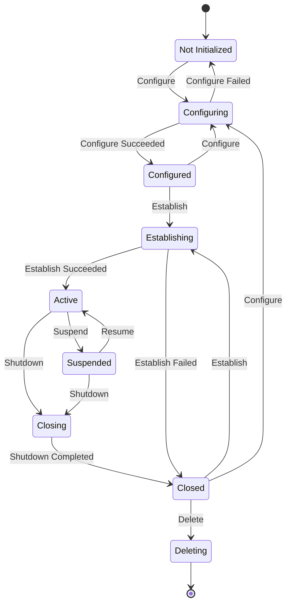
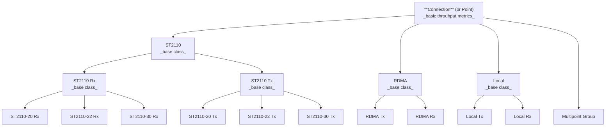
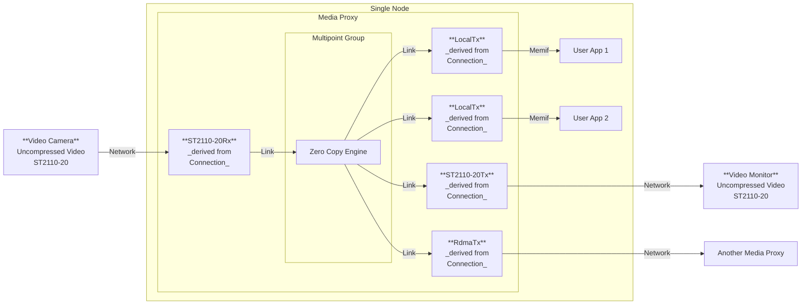

# Concept – New Architecture of Media Proxy to Support Multipoint Groups

## Connection (base class)
* Interface for Transmitting data – _may be implemented in the derived class_.
* Interface for Receiving data – _may be implemented in the derived class_.
* State – _When changes, triggers an Event_.
  * `Not Configured` – _After initialization._
  * `Configured`
  * `Establishing`
  * `Active`
  * `Suspended`
  * `Closing`
  * `Closed`
  * `Deleting`
* Operations
  * `Create` – _Performed by constructor_.
  * `Configure`
  * `Establish`
  * `Suspend` – _For test/debug purposes_.
  * `Resume` – _For test/debug purposes_.
  * `Shutdown`
  * `Delete` – _Initiated externally. Can't be performed by the Connection class_.
* Status – _When changes, triggers an Event_.
  * `Initial`
  * `Transition`
  * `Healthy`
  * `Failure`
  * `Shutdown`
* Base metrics
  * Throughput – _Move calculation to the Telemetry extractor level_.
  * Transaction counter.
  * Byte counter.
  * Error counter.
  * Status.
  * State.
  * Maciej suggested:
    * Backend load / capacity metric. Report example: `load: 85%` – _Secondary_.
    * Interface to enable/disable metrics by name.
  * Tomasz suggested:
    * Unified logger interface.
* Information
  * Created at.
  * Established at.
* Interface for sending metrics.
* Metrics Reset interface – _Access from MCM Agent, option to clear all or certain metrics_.

### Intermediary Layer: ST2110, RDMA, Local
* Base functionality of the specific backend.

### Backend Layer: (xxx)-Tx, (xxx)-Rx

* Transmitter or Receiver functionality of the specific backend.

## Connection Lifecycle State Diagram

## Diagram of Classes

### Interface for Receiving data
* **Research** – Analyze the ST2110-XX Rx code and find how the new data appears.
* **Research** – Analyze the RDMA Rx code and find how the new data appears.
* **`DONE`** **Research** – Analyze the Memif Rx code and find how the new data appears.
* Identify how the interface for Receiving data can be defined.

### Interface for Transmitting data
* **Research** – Analyze the ST2110-XX Tx code and find how the data is sent.
* **Research** – Analyze the RDMA Tx code and find how the data is sent.
* **`DONE`** **Research** – Analyze the Memif Tx code and find how the data is sent.
* Identify how the interface for Transmitting data can be defined.

### Interface for sending metrics
* The base **Connection** class defines a virtual method that returns an array of metrics, each with a name, a type, and a values.
* The Telemetry engine periodically calls this method and forwards the returned metrics to MCM Agent.

### Metrics Reset interface
* MCM Agent sends a list of metric names to be reset.
* Counters and triggers can be reset using this interface.
* The base **Connection** class defines a virtual method that takes a list of metric names and resets them by name.
* Derived classes that have counters and triggers specific to a particular backend can override the method to reset additional metrics.

## Bridge
* Type
  * Ingress Bridge – _Inbound traffic to Multipoint Group_.
  * Egress Bridge – _Outbound traffic from Multipoint Group_.
* Bridge stores an identifier of a Connection class object.
* Status and state are taken directly from the linked Connection class object.

## Multipoint Group
* Stores a list of members in the group
* Every member is of **Connection** class type.
* One Producer/Importer – _Can be null_.
* Many Consumers/Exporters – _Can be null_.
* Can have no Producers but many Consumers.
* Can have one Producer and no Consumers.
* Can have no Producers and no Consumers – _Empty group_.
* Business logic
  * If no Producers or no Consumers, no traffic is passing. Status: `Inactive`.
  * 
* State – When changes, triggers an Event.
  * `Created` – _After initialization._
  * `Enabling`
  * `Enabled`
  * `Disabling`
  * `Disabled`
  * `Deleting`
* Operations
  * `Create` – _Performed by constructor_.
  * `Enable`
  * `Disable` – _For test/debug purposes_.
  * `Delete` – _Initiated externally. Can't be performed by the Multipoint Group class_.
* Status – When changes, triggers an Event.
  * `Healthy` – _Green, active traffic is passing_.
  * `Inactive` – _Yellow, no activity_.
  * `Failure` – _Red, no activity_.
* Base metrics
  * Throughput.
  * Transaction counter.
  * Byte counter.
  * Error counter.
  * Status.
  * State.
* Information
  * Created at.
  * Enabled at.

### Multipoint Group – Example 1

### Multipoint Group – Example 2, 3, etc.
TBD