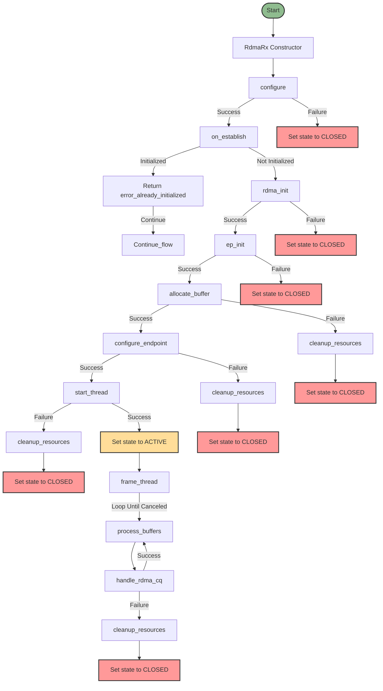
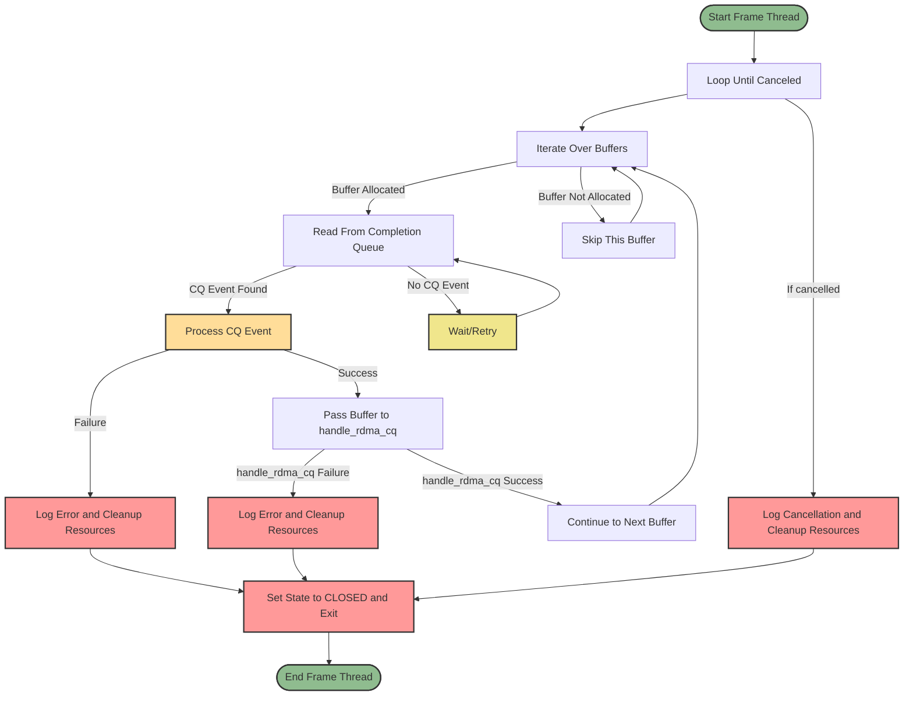
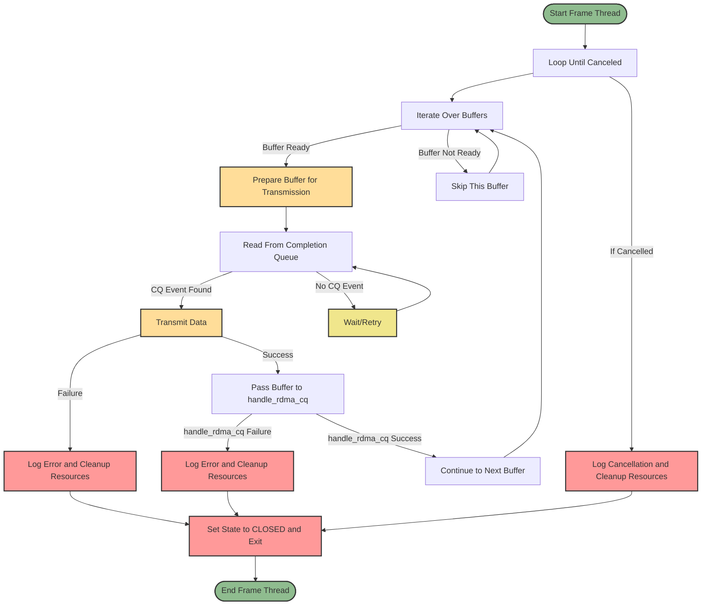

Mermaid flow of RdmaRx:

-------------------------------------------------------------------------------

Mermaid flow of RdmaRx frame_thread:

-------------------------------------------------------------------------------

Mermaid flow of RdmaTx frame_thread:

