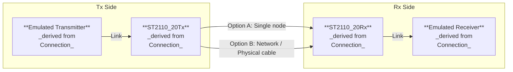

# Development – New Architecture of Media Proxy to Support Multipoint Groups

## Scope
1. **`DONE`** Local connection (memif based)
   * **`IN PROGRESS`** Local base class – `mesh::connection::Local`, derived from `mesh::connection::Connection`.
      * **`IN PROGRESS`** Local Tx class – `mesh::connection::LocalTx`
      * **`IN PROGRESS`** Local Rx class – `mesh::connection::LocalRx`
1. RDMA connection
   * RDMA base class – `mesh::connection::Rdma`, derived from `mesh::connection::Connection`.
      * RDMA Tx class – `mesh::connection::RdmaTx`
      * RDMA Rx class – `mesh::connection::RdmaRx`
1. ST2110 connection
   * ST2110 base class – `mesh::connection::ST2110`, derived from `mesh::connection::Connection`.
      * ST2110 Tx base class – `mesh::connection::ST2110Tx`
         * ST2110-20 Tx class – `mesh::connection::ST2110_20Tx`
         * ST2110-22 Tx class – `mesh::connection::ST2110_22Tx`
         * ST2110-30 Tx class – `mesh::connection::ST2110_30Tx`
      * ST2110 Rx base class – `mesh::connection::ST2110Rx`
         * ST2110-20 Rx class – `mesh::connection::ST2110_20Rx`
         * ST2110-22 Rx class – `mesh::connection::ST2110_22Rx`
         * ST2110-30 Rx class – `mesh::connection::ST2110_30Rx`

## How Is It Supposed To Work?


### Tx/Rx Test Scenario



### Rx Side

```cpp
using namespace mesh;

class EmulatedReceiver : public connection::Connection {
public:
    EmulatedReceiver() : _kind(connection::Kind::receiver) {}

    connection::Result on_establish(context::Context& ctx) {
        set_state(ctx, connection::State::active);
    }

    connection::Result on_shutdown(context::Context& ctx) {}

    connection::Result on_receive(context::Context& ctx, void *ptr, uint32_t sz,
                                  uint32_t& sent) {
        printf("Received %s (%u)\n", (char *)ptr, sz);
    }
};

int main()
{
    auto ctx = context::WithCancel(mesh::context::Background());
    connection::Result res;

    // Setup Emulated Receiver
    auto emulated_rx = new EmulatedReceiver;
    emulated_rx->establish(ctx);

    // Setup Rx connection
    auto conn_rx = new mesh::connection::ST2110_20Rx;

    res = conn_rx->configure(ctx, some_ST2110_20Rx_related_config);
    if (res != connection::Result::success) {
        printf("Configure Rx failed: %s\n", mesh::connection::result2str(res));
        goto exit;
    }
    res = conn_rx->establish(ctx);
    if (res != connection::Result::success) {
        printf("Establish Rx failed: %s\n", mesh::connection::result2str(res));
        goto exit;
    }

    // Connect Rx connection to Emulated Receiver
    conn_rx->set_link(ctx, emulated_rx);

    // Sleep some sufficient time to allow receiving the data from transmitter
    mesh::thread::Sleep(ctx, std::chrono::milliseconds(5000));

exit:
    // Shutdown Rx connection
    res = conn_rx->shutdown(ctx);
    if (res != connection::Result::success) {
        printf("Shutdown Rx failed: %s\n", mesh::connection::result2str(res));
    }

    // Destroy resources
    delete conn_rx;
    delete emulated_rx;

    return 0;
}
```

### Tx Side
```cpp
using namespace mesh;

class EmulatedTransmitter : public connection::Connection {
public:
    EmulatedTransmitter() : _kind(connection::Kind::transmitter) {}

    connection::Result on_establish(context::Context& ctx) {
        set_state(ctx, connection::State::active);
    }

    connection::Result on_shutdown(context::Context& ctx) {}
};

int main()
{
    auto ctx = context::WithCancel(mesh::context::Background());
    connection::Result res;

    auto conn_tx = new mesh::connection::ST2110_20Tx;
    auto emulated_tx = new EmulatedTransmitter;

    // Setup Tx connection
    res = conn_tx->configure(ctx, some_ST2110_20Tx_related_config);
    if (res != connection::Result::success) {
        printf("Configure Tx failed: %s\n", mesh::connection::result2str(res));
        goto exit;
    }
    res = conn_tx->establish(ctx);
    if (res != connection::Result::success) {
        printf("Establish Tx failed: %s\n", mesh::connection::result2str(res));
        goto exit;
    }

    // Setup Emulated Transmitter
    emulated_tx->establish(ctx);

    // Connect Emulated Transmitter to Tx connection
    emulated_tx->set_link(ctx, conn_tx);

    // Send data
    for (int i = 0; i < 5; i++) {
        res = emulated_tx->transmit(ctx, "Hello world", 12); // Use appropriate data here
        if (res != connection::Result::success) {
            printf("Transmit failed: %s\n", mesh::connection::result2str(res));
            break;
        }
    }

exit:
    // Shutdown Tx connection
    res = conn_tx->shutdown(ctx);
    if (res != connection::Result::success) {
        printf("Shutdown Tx failed: %s\n", mesh::connection::result2str(res));
    }

    // Destroy resources
    delete emulated_tx;
    delete conn_tx;

    return 0;
}
```

### Test Scenario
1. Start **Rx Side**.
2. Start **Tx Side**.
3. Check the **Rx Side** log output to be as the following
```bash
Received Hello world (12)
Received Hello world (12)
Received Hello world (12)
Received Hello world (12)
Received Hello world (12)
```
