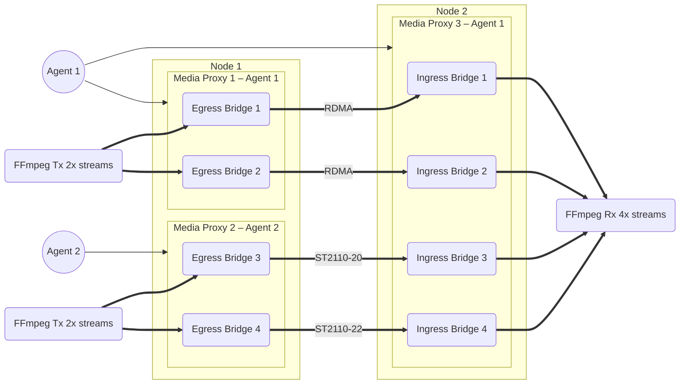

# Geneva Demo

```mermaid
flowchart LR
    agent1((Agent 1)) --> proxy3
    agent1 --> proxy1
    agent2((Agent 2)) --> proxy2

    subgraph node1[Node 1]

        subgraph proxy1[Media Proxy 1 – Agent 1]
            tx-bridge1(Egress Bridge 1)
            tx-bridge2(Egress Bridge 2)
        end

        subgraph proxy2[Media Proxy 2 – Agent 2]
            tx-bridge3(Egress Bridge 3)
            tx-bridge4(Egress Bridge 4)
        end

    end

    subgraph node2[Node 2]

        subgraph proxy3[Media Proxy 3 – Agent 1]
            rx-bridge1(Ingress Bridge 1)
            rx-bridge2(Ingress Bridge 2)
            rx-bridge3(Ingress Bridge 3)
            rx-bridge4(Ingress Bridge 4)
        end
    end

    tx-bridge1 == RDMA ==> rx-bridge1
    tx-bridge2 == RDMA ==> rx-bridge2

    tx-bridge3 == ST2110-20 ==> rx-bridge3
    tx-bridge4 == ST2110-22 ==> rx-bridge4

    rx-bridge1 ==> ffmpeg-rx(FFmpeg Rx 4x streams)
    rx-bridge2 ==> ffmpeg-rx
    rx-bridge3 ==> ffmpeg-rx
    rx-bridge4 ==> ffmpeg-rx

    ffmpeg-tx1(FFmpeg Tx 2x streams) ==> tx-bridge1
    ffmpeg-tx1 ==> tx-bridge2

    ffmpeg-tx2(FFmpeg Tx 2x streams) ==> tx-bridge3
    ffmpeg-tx2 ==> tx-bridge4
```
