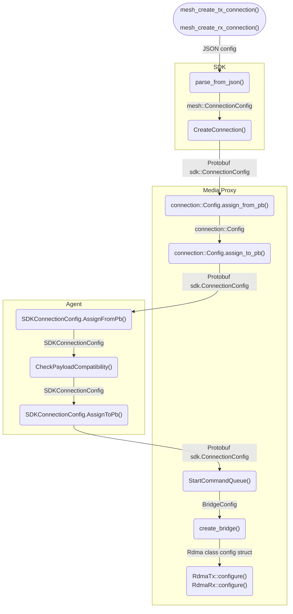

# SDK Bridge-related Parameter Propagation — Developer's Guide

SDK allows passing some parameters to be applied when Egress or Ingress Bridge is created in Media Proxy.

When adding or modifying any of the RDMA or SMPTE ST 2110 SDK parameters, many parts of code should be adjusted accordingly. The affected software components are SDK, Media Proxy, and Agent.

The following diagram shows the propagation flow of SDK parameters from the JSON configuration to the bridge's `configure()` method. RDMA classes are taken as an example.

> Note: Each function AND each data structure mentioned in the diagram should be revised and adjusted appropriately.

## Checklist: What to adjust to enable passing SDK parameters to the recipient class configuration?

1. Adjust the SDK code
    * Structure `mesh::ConnectionConfig`.
    * Method `parse_from_json()`
    * Proto file `conn-config.proto` – Add/Modify/Remove fields.
    * Method `CreateConnection()`.
1. Adjust the Media Proxy code
    * Structure `connection::Config`.
    * Method `connection::Config.assign_from_pb()`.
    * Method `connection::Config.assign_to_pb()`.
1. Adjust the Agent code
    * Structure `SDKConnectionConfig`.
    * Function `SDKConnectionConfig.AssignFromPb()`.
    * Function `CheckPayloadCompatibility()`.
    * Function `SDKConnectionConfig.AssignToPb()`.
1. Adjust the Media Proxy code
    * Structure `BridgeConfig`.
    * Method `StartCommandQueue()`.
    * Recipient class config struct, e.g. RDMA.
    * Method `create_bridge()`.
1. Update documentation.
