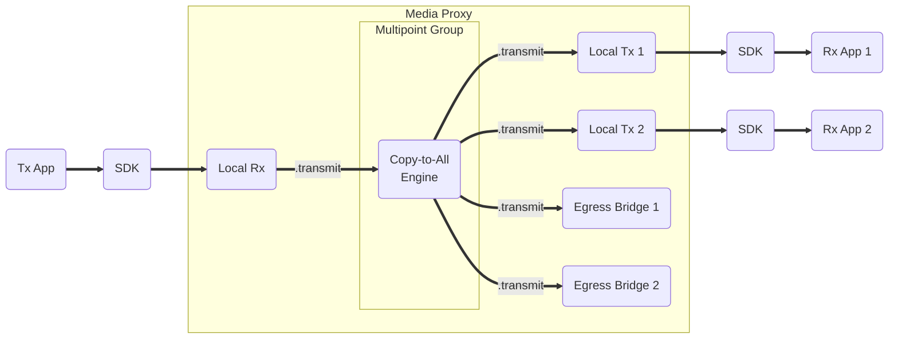
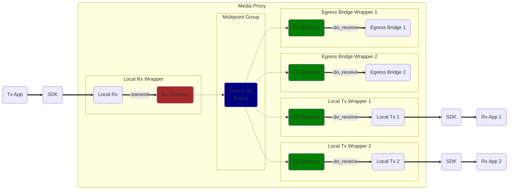
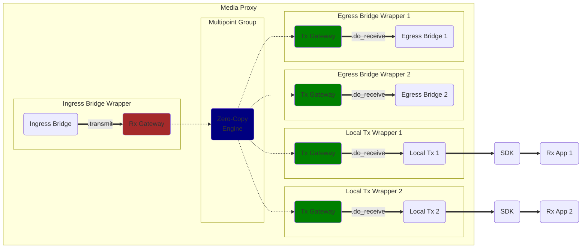
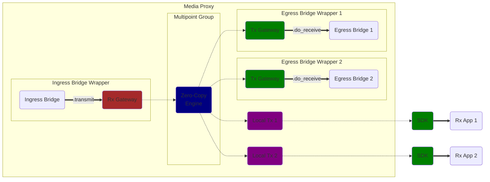
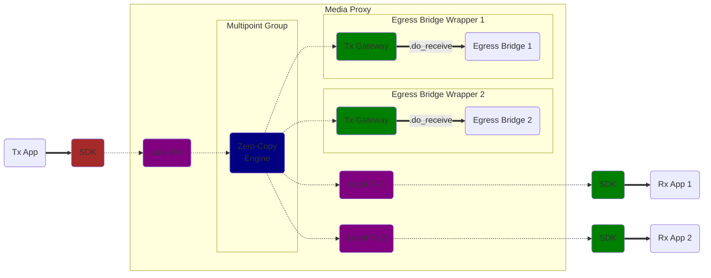
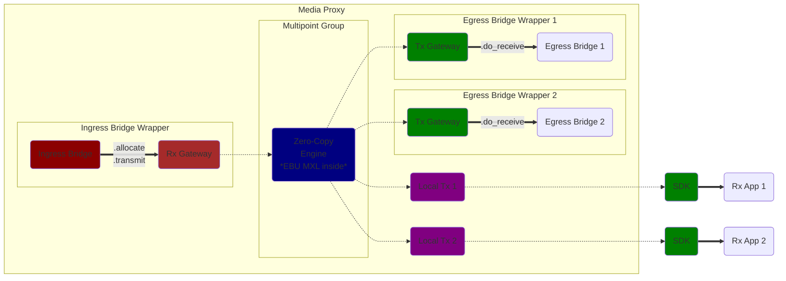
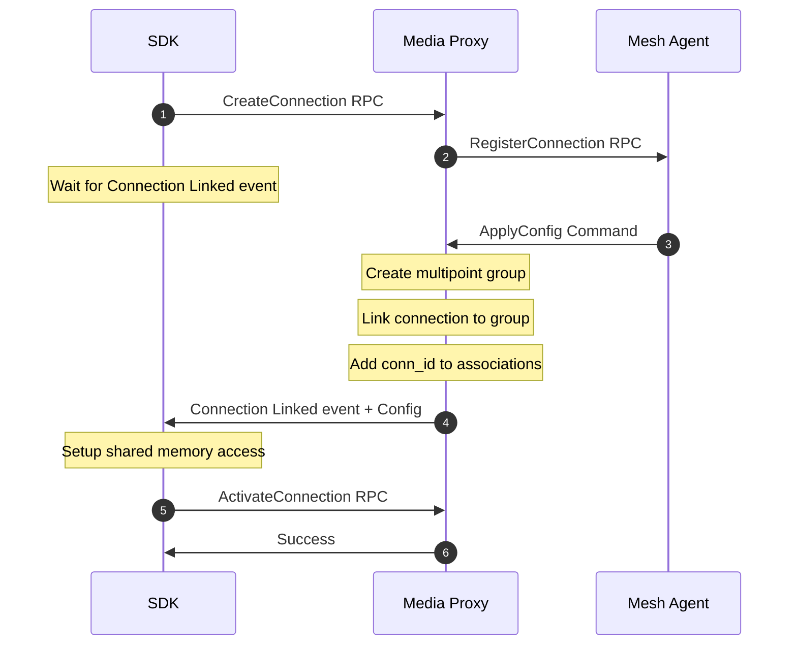
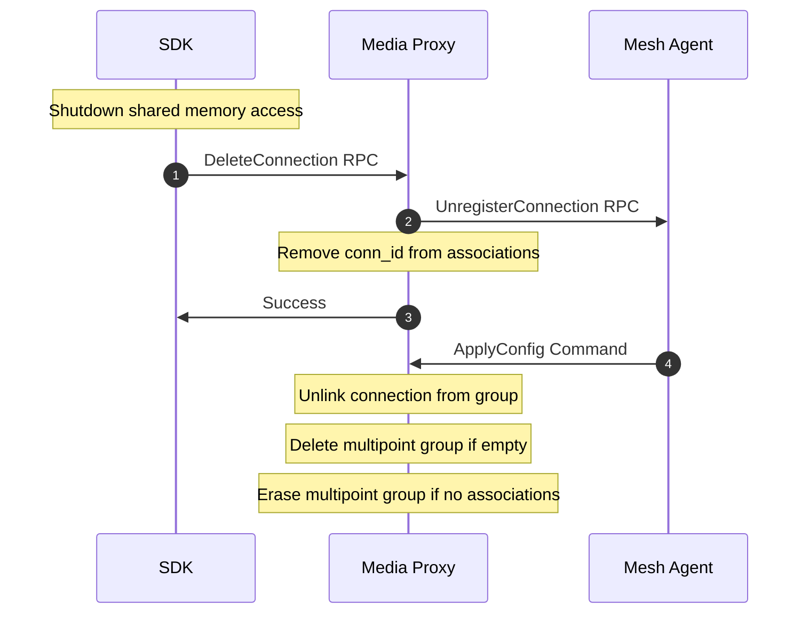
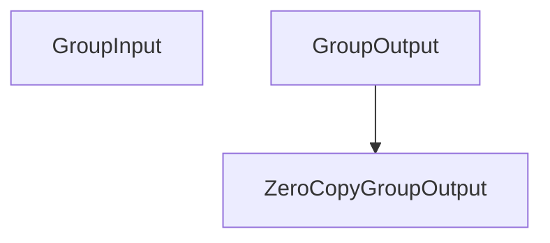

# Zero Copy — Development Notes

## Existing Multipoint Group Implementation

### Example Case – User App sends media stream

## Development Phase 1 – Implement Zero-Copy Multipoint Group and Tx/Rx Gateways

### Case 1.1 – User App sends media stream

### Case 1.2 – Receive external ST2110 media stream

## Development Phase 2 – Add Zero-Copy Support in SDK

### Case 2.1 – Receive external ST2110 media stream

### Case 2.2 – User App sends media stream

## Development Phase 3 – Add Zero-Copy Support in Ingress Bridges

### Case 3.1 – Receive external ST2110 media stream

## Zero-Copy Connection Creation flow

## Zero-Copy Connection Deletion flow

## Class diagram

