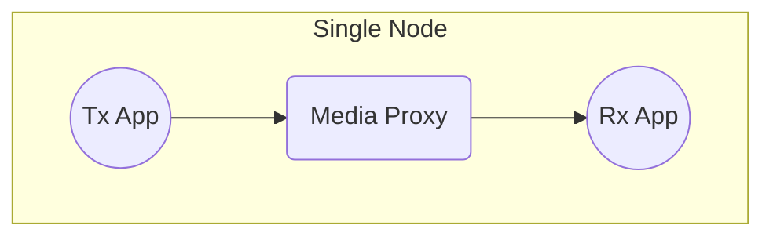

# Scenario Set 1 – Local Single Node Transmission (memif)

## Scenario 1.1 – Single Node / Single Receiver

### Configuration

```mermaid
flowchart
    subgraph Single Node
        tx((Tx App))
        rx((Rx App))
        proxy(Media Proxy)
    end
    tx --> proxy
    proxy --> rx
```

### Payload Options

* Blob
* Video – Uncompressed
* Audio
