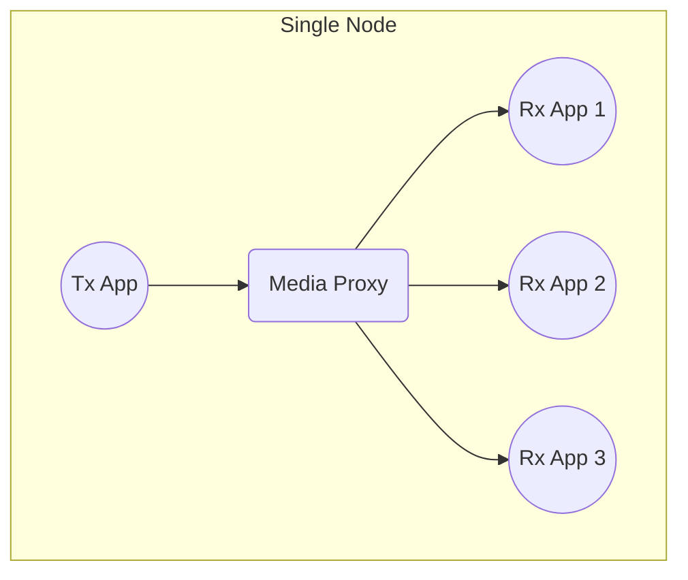

# Scenario Set 1 – Local Single Node Transmission (memif)

## Scenario 1.2 – Single Node / 3x Receivers

### Configuration

### Payload Options

* Blob
* Video – Uncompressed
* Audio

### Test Cases

For detailed test cases, refer to the centralized [Test Cases documentation](../SCENARIO.md#test-cases).
