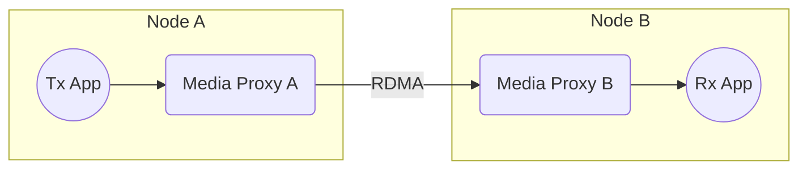

# Scenario Set 2 – RDMA Transmission

## Scenario 2.1 – 2x Nodes / Single Receiver – Direct Network Cable Connection

### Configuration

### Payload Options

* Blob
* Video – Uncompressed
* Audio

### Test Cases

For detailed test cases, refer to the centralized [Test Cases documentation](../SCENARIO.md#test-cases).
