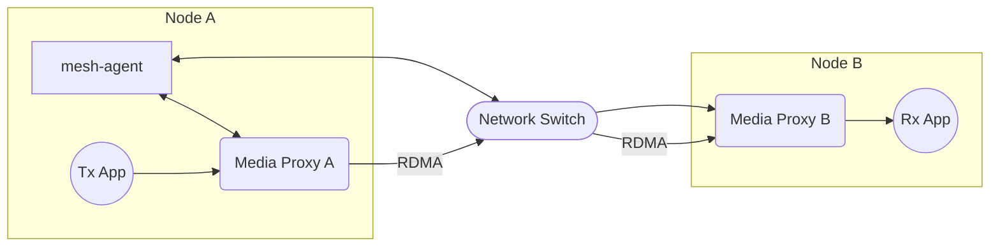

# Scenario Set 2 – RDMA Transmission

## Scenario 2.2 – 2x Nodes / Single Receiver

### Configuration



### Test Cases

#### 2.2.1 Standalone

#### Blob

#### Node A

1. Start the `mesh-agent`:
    ```bash
    mesh-agent
    ```

2. Start the media proxy:
    ```bash
    sudo media_proxy -r <IP_A> -p 9300-9399 -t 8003
    ```

3. Create the client configuration file (`client_tx.json`):
    ```json
    {
        "apiVersion": "v1",
        "apiConnectionString": "Server=127.0.0.1; Port=8003",
        "apiDefaultTimeoutMicroseconds": 100000,
        "maxMediaConnections": 32
    }
    ```

4. Create the connection configuration file (`connection_tx.json`):
    ```json
    {
        "bufferQueueCapacity": 16,
        "maxMetadataSize": 8192,
        "connection": {
            "multipointGroup": {
                "urn": "ipv4:224.0.0.1:9003"
            }
        },
        "payload": {
            "blob": {}
        },
        "maxPayloadSize": 2097152
    }
    ```

5. Start the transmitter application:
    ```bash
    sudo MCM_MEDIA_PROXY_PORT=8003 ./TxApp client_tx.json connection_tx.json input_video.yuv
    ```

#### Node B

1. Start the media proxy:
    ```bash
    sudo NO_PROXY=<IP_A> media_proxy -r <IP_B> -p 9300-9399 -t 8003 --agent=<IP_A>:50051
    ```

2. Create the client configuration file (`client_rx.json`):
    ```json
    {
        "apiVersion": "v1",
        "apiConnectionString": "Server=127.0.0.1; Port=8003",
        "apiDefaultTimeoutMicroseconds": 100000,
        "maxMediaConnections": 32
    }
    ```

3. Create the connection configuration file (`connection_rx.json`):
    ```json
    {
        "bufferQueueCapacity": 16,
        "maxMetadataSize": 8192,
        "connection": {
            "multipointGroup": {
                "urn": "ipv4:224.0.0.1:9003"
            }
        },
        "payload": {
            "blob": {}
        },
        "maxPayloadSize": 2097152
    }
    ```

4. Start the receiver application:
    ```bash
    sudo NO_PROXY=<IP_A> MCM_MEDIA_PROXY_PORT=8003 ./RxApp client_rx.json connection_rx.json output_new.yuv
    ```


#### Video

#### Node A

1. Start the `mesh-agent`:
    ```bash
    mesh-agent
    ```

2. Start the media proxy:
    ```bash
    sudo media_proxy -r <IP_A> -p 9300-9399 -t 8003
    ```

3. Create the client configuration file (`client_tx.json`):
    ```json
    {
        "apiVersion": "v1",
        "apiConnectionString": "Server=127.0.0.1; Port=8003",
        "apiDefaultTimeoutMicroseconds": 100000,
        "maxMediaConnections": 32
    }
    ```

4. Create the connection configuration file (`connection_tx.json`):
    ```json
    {
        "bufferQueueCapacity": 16,
        "maxMetadataSize": 8192,
        "connection": {
            "multipointGroup": {
                "urn": "ipv4:224.0.0.1:9003"
            }
        },
        "payload": {
            "video": {
                "width": <WIDTH>,
                "height": <HEIGHT>,
                "fps": <FPS>,
                "pixelFormat": <PIXEL_FORMAT>
            }
        }
    }
    ```

5. Start the transmitter application:
    ```bash
    sudo MCM_MEDIA_PROXY_PORT=8003 ./TxApp client_tx.json connection_tx.json input_video.yuv
    ```

#### Node B

1. Start the media proxy:
    ```bash
    sudo NO_PROXY=<IP_A> media_proxy -r <IP_B> -p 9300-9399 -t 8003 --agent=<IP_A>:50051
    ```

2. Create the client configuration file (`client_rx.json`):
    ```json
    {
        "apiVersion": "v1",
        "apiConnectionString": "Server=127.0.0.1; Port=8003",
        "apiDefaultTimeoutMicroseconds": 100000,
        "maxMediaConnections": 32
    }
    ```

3. Create the connection configuration file (`connection_rx.json`):
    ```json
    {
        "bufferQueueCapacity": 16,
        "maxMetadataSize": 8192,
        "connection": {
            "multipointGroup": {
                "urn": "ipv4:224.0.0.1:9003"
            }
        },
        "payload": {
            "video": {
                "width": <WIDTH>,
                "height": <HEIGHT>,
                "fps": <FPS>,
                "pixelFormat": <PIXEL_FORMAT>
            }
        }
    }
    ```

4. Start the receiver application:
    ```bash
    sudo NO_PROXY=<IP_A> MCM_MEDIA_PROXY_PORT=8003 ./RxApp client_rx.json connection_rx.json output_new.yuv
    ```

#### Audio

#### Node A

1. Start the `mesh-agent`:
    ```bash
    mesh-agent
    ```

2. Start the media proxy:
    ```bash
    sudo media_proxy -r <IP_A> -p 9300-9399 -t 8003
    ```

3. Create the client configuration file (`client_tx.json`):
    ```json
    {
        "apiVersion": "v1",
        "apiConnectionString": "Server=127.0.0.1; Port=8003",
        "apiDefaultTimeoutMicroseconds": 100000,
        "maxMediaConnections": 32
    }
    ```

4. Create the connection configuration file (`connection_tx.json`):
    ```json
    {
        "bufferQueueCapacity": 16,
        "maxMetadataSize": 8192,
        "connection": {
            "multipointGroup": {
                "urn": "ipv4:224.0.0.1:9003"
            }
        },
        "payload": {
            "audio": {
                "channels": <CHANNELS>,
                "sampleRate": <SAMPLE_RATE>,
                "format": "<AUDIO_ENCODING>",
                "packetTime": "<PACKET_TIME>"
            }
        }
    }
    ```

5. Start the transmitter application:
    ```bash
    sudo MCM_MEDIA_PROXY_PORT=8003 ./TxApp client_tx.json connection_tx.json input_video.yuv
    ```

#### Node B

1. Start the media proxy:
    ```bash
    sudo NO_PROXY=<IP_A> media_proxy -r <IP_B> -p 9300-9399 -t 8003 --agent=<IP_A>:50051
    ```

2. Create the client configuration file (`client_rx.json`):
    ```json
    {
        "apiVersion": "v1",
        "apiConnectionString": "Server=127.0.0.1; Port=8003",
        "apiDefaultTimeoutMicroseconds": 100000,
        "maxMediaConnections": 32
    }
    ```

3. Create the connection configuration file (`connection_rx.json`):
    ```json
    {
        "bufferQueueCapacity": 16,
        "maxMetadataSize": 8192,
        "connection": {
            "multipointGroup": {
                "urn": "ipv4:224.0.0.1:9003"
            }
        },
        "payload": {
            "audio": {
                "channels": <CHANNELS>,
                "sampleRate": <SAMPLE_RATE>,
                "format": "<AUDIO_ENCODING>",
                "packetTime": "<PACKET_TIME>"
            }
        }
    }
    ```

4. Start the receiver application:
    ```bash
    sudo NO_PROXY=<IP_A> MCM_MEDIA_PROXY_PORT=8003 ./RxApp client_rx.json connection_rx.json output_new.yuv
    ```

#### Blob

| Test Case | Data Size | Data Source  | Notes |
|-----------|-----------|--------------|-------|
| 2.2.1.1   | 100 MB    | /dev/random  | Test transmission of random binary data block |

#### Video

| Test Case | Resolution | Framerate (FPS)  | Color Format            | Interlace   | Packing | Pacing | Notes                       |
|-----------|------------|------------------|-------------------------|-------------|---------|--------|-----------------------------|
| 2.2.1.2   | 1920x1080  | 60               | YUV 4:2:2 10-bit planar | Progressive | gpm     | Wide   | Default configuration       |
| 2.2.1.3   | 1920x1080  | 59.94            | YUV 4:2:2 10-bit planar | Progressive | gpm     | Wide   | Test different framerate    |
| 2.2.1.4   | 3840x2160  | 60               | YUV 4:2:2 10-bit planar | Progressive | gpm     | Wide   | Test higher resolution      |
| 2.2.1.5   | 3840x2160  | 59.94            | YUV 4:2:2 10-bit planar | Progressive | gpm     | Wide   | Test higher res & framerate |
| 2.2.1.6   | 1920x1080  | 60               | YUV 4:2:2 10-bit planar | Progressive | bpm     | Wide   | Test different packing      |
| 2.2.1.7   | 1920x1080  | 60               | YUV 4:2:2 10-bit planar | Progressive | gpm_sl  | Wide   | Test different packing      |
| 2.2.1.8   | 1920x1080  | 60               | YUV 4:2:2 10-bit planar | Progressive | gpm     | Narrow | Test different pacing       |
| 2.2.1.9   | 1920x1080  | 60               | YUV 4:2:2 10-bit planar | Progressive | gpm     | Linear | Test different pacing       |

Json parameters:

| Test Case | WIDTH | HEIGHT | FPS  | PIXEL_FORMAT    |
|-----------|-------|--------|------|-----------------|
| 2.2.1.2   | 1920  | 1080   | 60   | yuv422p10le     |
| 2.2.1.3   | 1920  | 1080   | 59.94| yuv422p10le     |
| 2.2.1.4   | 3840  | 2160   | 60   | yuv422p10le     |
| 2.2.1.5   | 3840  | 2160   | 59.94| yuv422p10le     |
| 2.2.1.6   | 1920  | 1080   | 60   | yuv422p10le     |
| 2.2.1.7   | 1920  | 1080   | 60   | yuv422p10le     |
| 2.2.1.8   | 1920  | 1080   | 60   | yuv422p10le     |
| 2.2.1.9   | 1920  | 1080   | 60   | yuv422p10le     |


#### Audio

| Test Case | Audio Format           | Sample Rate | Number of Channels | packetTime | Notes                                       |
|-----------|------------------------|-------------|--------------------|------------|---------------------------------------------|
| 2.2.1.10  | PCM 8-bit Big-Endian   | 44100 Hz    | Mono               | 1.09ms     | Default configuration for basic audio test  |
| 2.2.1.11  | PCM 16-bit Big-Endian  | 48000 Hz    | Stereo             | 1ms        | Common configuration for high-quality audio |
| 2.2.1.12  | PCM 24-bit Big-Endian  | 96000 Hz    | Mono               | 1ms        | High sample rate for professional audio     |
| 2.2.1.13  | PCM 16-bit Big-Endian  | 44100 Hz    | Stereo             | 1ms        | Test lower sample rate with stereo          |
| 2.2.1.14  | PCM 24-bit Big-Endian  | 48000 Hz    | Mono               | 1ms        | Test high bit depth with standard sample rate |

Json parameters:

| Test Case | CHANNELS | SAMPLE_RATE | AUDIO_ENCODING | PACKET_TIME |
|-----------|----------|-------------|----------------|-------------|
| 2.2.1.10  | 1        | 44100       | pcm_s8         | 1.09ms      |
| 2.2.1.11  | 2        | 48000       | pcm_s16be      | 1ms         |
| 2.2.1.12  | 1        | 96000       | pcm_s24be      | 1ms         |
| 2.2.1.13  | 2        | 44100       | pcm_s16be      | 1.09ms      |
| 2.2.1.14  | 1        | 48000       | pcm_s24be      | 1ms         |


#### 2.2.2 FFmpeg

#### Blob

Not supported.

#### Video

#### Node A
```bash
mesh-agent
sudo media_proxy -r <IP_A> -p 9300-9399 -t 8003
```
```bash
sudo MCM_MEDIA_PROXY_PORT=8003 ffmpeg -re -video_size <WIDTH>x<HEIGHT> \
    -pixel_format <PIXEL_FORMAT> \
    -i <VIDEO_INPUT_FILE_PATH> \
    -f mcm \
    -conn_type multipoint-group \
    -frame_rate <FPS> \
    -video_size <WIDTH>x<HEIGHT> \
    -pixel_format <PIXEL_FORMAT> \
    -
```

#### Node B
```bash
sudo NO_PROXY=$NO_PROXY,<IP_A> media_proxy -r <IP_B> -p 9300-9399 -t 8003 --agent=<IP_A>:50051
```
```bash
sudo MCM_MEDIA_PROXY_PORT=8003 ffmpeg -f mcm \
    -conn_type multipoint-group \
    -frame_rate <FPS> \
    -video_size <WIDTH>x<HEIGHT> \
    -pixel_format <PIXEL_FORMAT> \
    -i - \
    <VIDEO_OUTPUT_FILE_PATH> -y
```

#### Audio

#### Node A
```bash
mesh-agent
sudo media_proxy -r <IP_A> -p 9300-9399 -t 8003
```
```bash
sudo MCM_MEDIA_PROXY_PORT=8003 ffmpeg -re -i <AUDIO_INPUT_FILE_PATH> \
    -f mcm_audio_pcm<AUDIO_ENCODING> \
    -conn_type multipoint-group \
    -channels <CHANNELS> \
    -sample_rate <SAMPLE_RATE> \
    -ptime <PACKET_TIME> \
    -
```

#### Node B
```bash
sudo NO_PROXY=$NO_PROXY,<IP_A> media_proxy -r <IP_B> -p 9300-9399 -t 8003 --agent=<IP_A>:50051
```
```bash
sudo MCM_MEDIA_PROXY_PORT=8003 ffmpeg -f mcm_audio_pcm<AUDIO_ENCODING> \
    -conn_type multipoint-group \
    -channels <CHANNELS> \
    -sample_rate <SAMPLE_RATE> \
    -ptime <PACKET_TIME> \
    -i - \
    <AUDIO_OUTPUT_FILE_PATH> -y
```

#### Blob

Not supported

#### Video
| Test Case | Resolution | Framerates (FPS) | Color Format            | Interlace   | Notes                       |
|-----------|------------|------------------|-------------------------|-------------|-----------------------------|
| 2.2.2.1   | 1920x1080  | 60               | YUV 4:2:2 10-bit planar | Progressive | Default configuration       |
| 2.2.2.2   | 1920x1080  | 59.94            | YUV 4:2:2 10-bit planar | Progressive | Test different framerate    |
| 2.2.2.3   | 3840x2160  | 60               | YUV 4:2:2 10-bit planar | Progressive | Test higher resolution      |
| 2.2.2.4   | 3840x2160  | 59.94            | YUV 4:2:2 10-bit planar | Progressive | Test higher res & framerate |

#### Audio

| Test Case | Audio Format           | Sample Rate | Number of Channels | Notes                                       |
|-----------|------------------------|-------------|--------------------|---------------------------------------------|
| 2.2.2.5   | PCM 16-bit Big-Endian  | 48000 Hz   | Mono               | Default configuration for FFmpeg audio test |
| 2.2.2.6   | PCM 24-bit Big-Endian  | 96000 Hz   | Stereo             | High-quality audio configuration            |
| 2.2.2.7   | PCM 16-bit Big-Endian  | 96000 Hz   | Stereo             | Test high sample rate with stereo           |
| 2.2.2.8   | PCM 24-bit Big-Endian  | 48000 Hz   | Mono               | Test high bit depth with standard sample rate |