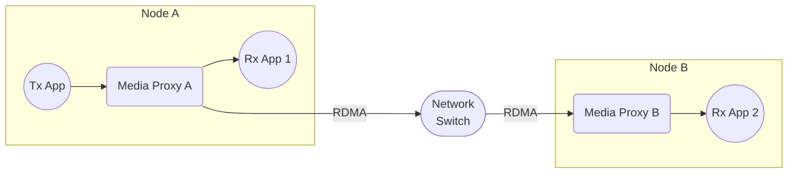

# Scenario Set 2 – RDMA Transmission

## Scenario 2.3 – 2x Nodes / 1x Receiver per Node

### Configuration

```mermaid
flowchart LR
    subgraph Node B
        rxB1((Rx App 2))
        proxy2(Media Proxy B)
    end
    subgraph Node A
        rxA1((Rx App 1))
        tx((Tx App))
        proxy1(Media Proxy A)
    end
    sw(["Network
        Switch"])
    tx --> proxy1
    proxy1 --> rxA1
    proxy1 -- RDMA ----> sw
    sw -- RDMA --> proxy2
    proxy2 --> rxB1
```

### Payload Options

* Blob
* Video – Uncompressed
* Audio
