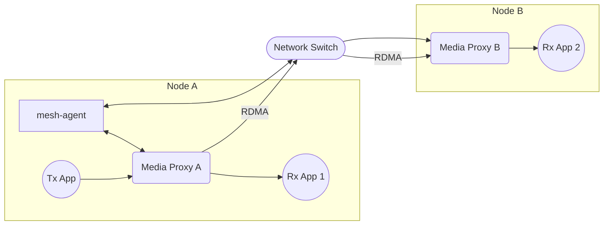

# Scenario Set 2 – RDMA Transmission

## Scenario 2.3 – 2x Nodes / 1x Receiver per Node

### Configuration



### Test Cases

#### 2.2.1 Standalone
#### Node A

```bash
mesh-agent
sudo media_proxy -r <IP_A> -p 9300-9399 -t 8003
```

**Client JSON:**

```json
{
    "apiVersion": "v1",
    "apiConnectionString": "Server=127.0.0.1; Port=8003",
    "apiDefaultTimeoutMicroseconds": 100000,
    "maxMediaConnections": 32
}
```

**Connection JSON:**

```json
{
    "bufferQueueCapacity": 16,
    "maxMetadataSize": 8192,
    "connection": {
        "multipointGroup": {
            "urn": "ipv4:224.0.0.1:9003"
        }
    },
    "payload": {
        "video": {
            "width": 1920,
            "height": 1080,
            "fps": 60,
            "pixelFormat": "yuv422p10le"
        }
    }
}
```

```bash
sudo NO_PROXY=<IP_A> MCM_MEDIA_PROXY_PORT=8003 ./RxApp client_rx.json connection_rx.json output_new.yuv
```

```bash
sudo MCM_MEDIA_PROXY_PORT=8003 ./TxApp client_tx.json connection_tx.json .input_video.yuv
```

#### Node B

```bash
sudo NO_PROXY=<IP_A> media_proxy -r <IP_B> -p 9300-9399 -t 8003 --agent=<IP_A>:50051
```

**Client JSON:**

```json
{
    "apiVersion": "v1",
    "apiConnectionString": "Server=127.0.0.1; Port=8003",
    "apiDefaultTimeoutMicroseconds": 100000,
    "maxMediaConnections": 32
}
```

**Connection JSON:**

```json
{
    "bufferQueueCapacity": 16,
    "maxMetadataSize": 8192,
    "connection": {
        "multipointGroup": {
            "urn": "ipv4:224.0.0.1:9003"
        }
    },
    "payload": {
        "video": {
            "width": 1920,
            "height": 1080,
            "fps": 60,
            "pixelFormat": "yuv422p10le"
        }
    }
}
```

```bash
sudo NO_PROXY=<IP_A> MCM_MEDIA_PROXY_PORT=8003 ./RxApp client_rx.json connection_rx.json output_new.yuv
```

##### 2.2.1.1 

#### 2.2.2 FFmpeg

#### Node A
```bash
mesh-agent
sudo media_proxy -r <IP_A> -p 9300-9399 -t 8003
```
```bash
sudo MCM_MEDIA_PROXY_PORT=8003 ffmpeg -re -video_size 1280x720 -pixel_format yuv422p10le -i ./input_video.yuv -f mcm -conn_type multipoint-group -frame_rate 60 -video_size 1280x720 -pixel_format yuv422p10le -
```
```bash
sudo MCM_MEDIA_PROXY_PORT=8003 ffmpeg -f mcm -conn_type multipoint-group -frame_rate 60 -video_size 1280x720 -pixel_format yuv422p10le -i - ./out_video.yuv -y
```

#### Node B
```bash
sudo NO_PROXY=$NO_PROXY,<IP_A> media_proxy -r <IP_B> -p 9300-9399 -t 8003 --agent=<IP_A>:50051
```
```bash
sudo MCM_MEDIA_PROXY_PORT=8003 ffmpeg -f mcm -conn_type multipoint-group -frame_rate 60 -video_size 1280x720 -pixel_format yuv422p10le -i - ./out_video.yuv -y
```

##### 2.2.2.1 Default