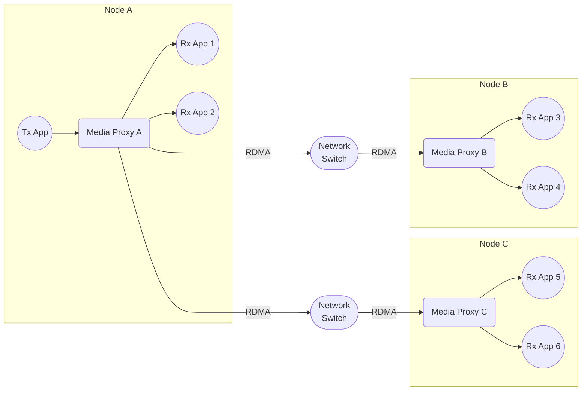

# Scenario Set 2 – RDMA Transmission

## Scenario 2.5 – 3x Nodes / 2x Receivers per Node

### Configuration

### Payload Options

* Blob
* Video – Uncompressed
* Audio

### Test Cases

For detailed test cases, refer to the centralized [Test Cases documentation](../SCENARIO.md#test-cases).
