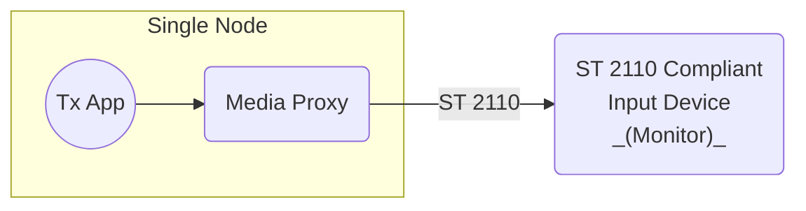

# Scenario Set 3 – SMPTE ST 2110 Outbound Transmission

## Scenario 3.1 – Single Node – Direct Network Cable Connection

### Payload Options

* Video – SMPTE ST 2110-20 Uncompressed Video
* Video – SMPTE ST 2110-22 Compressed Video (JPEG XS)
* Audio – SMPTE ST 2110-30 Uncompressed Audio (PCM)

### Notes

1. For SMPTE ST 2110-22 Compressed Video, consider the following
    * Tx App transmits uncompressed video frames.
    * External SMPTE ST 2110 compliant input device receives compressed video.

### Test Cases

For detailed test cases, refer to the centralized [Test Cases documentation](../SCENARIO.md#test-cases).
