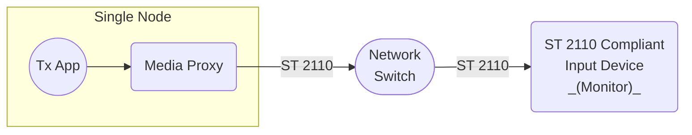

# Scenario Set 3 – SMPTE ST 2110 Outbound Transmission

## Scenario 3.2 – Single Node

### Configuration

### Payload Options

* Video – Uncompressed ST 2110-20
* Video – Compressed ST 2110-22
* Audio – ST 2110-30

### Notes

1. For Compressed Video ST 2110-22, consider the following
    * Tx App transmits uncompressed video frames.
    * External ST 2110 compliant input device receives compressed video.
