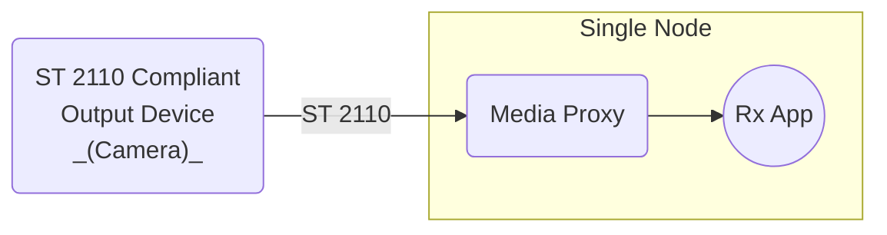

# Scenario Set 4 – SMPTE ST 2110 Inbound Transmission

## Scenario 4.1 – Single Node / Single Receiver — Direct Network Cable Connection

### Configuration

### Payload Options

* Video – Uncompressed ST 2110-20
* Video – Compressed ST 2110-22
* Audio – Uncompressed ST 2110-30

### Notes

1. For Compressed Video ST 2110-22, consider the following
    * External ST 2110 compliant output device transmits compressed video.
    * Rx App receives uncompressed video frames.
