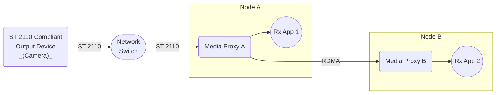

# Scenario Set 4 – SMPTE ST 2110 Inbound Transmission

## Scenario 4.4 – 2x Nodes / 1x Receiver per Node

### Configuration

### Payload Options

* Video – Uncompressed ST 2110-20
* Video – Compressed ST 2110-22
* Audio – Uncompressed ST 2110-30

### Notes

1. For Compressed Video ST 2110-22, consider the following
    * External ST 2110 compliant output device transmits compressed video.
    * Rx App 1, 2 receive uncompressed video frames.
