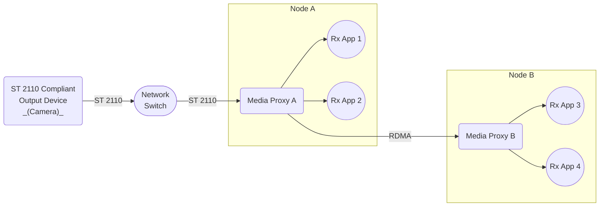

# Scenario Set 4 – SMPTE ST 2110 Inbound Transmission

## Scenario 4.5 – 2x Nodes / 2x Receivers per Node

### Configuration

### Output Device – Destination IP Address Options

* Unicast IP address
* Multicast IP address

### Payload Options

* Video – SMPTE ST 2110-20 Uncompressed Video
* Video – SMPTE ST 2110-22 Compressed Video (JPEG XS)
* Audio – SMPTE ST 2110-30 Uncompressed Audio (PCM)

### Notes

1. For SMPTE ST 2110-22 Compressed Video, consider the following
    * External SMPTE ST 2110 compliant output device transmits compressed video.
    * Rx App 1, 2, 3, 4 receive uncompressed video frames.
